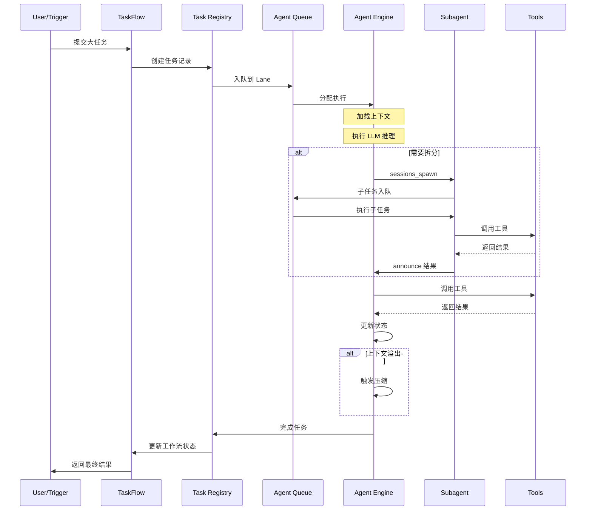
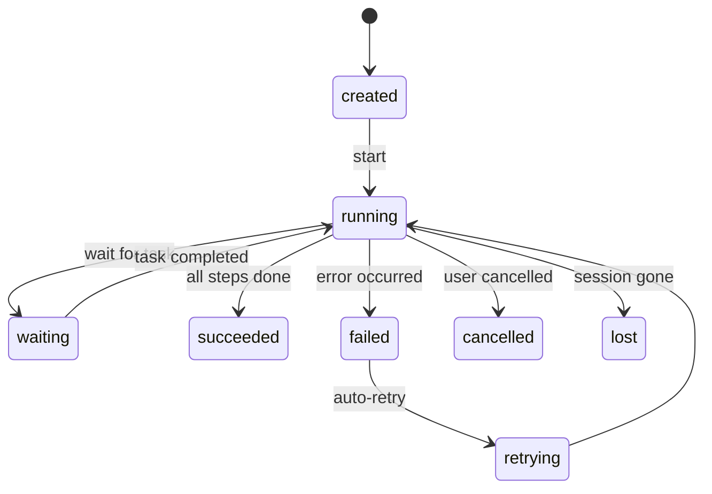
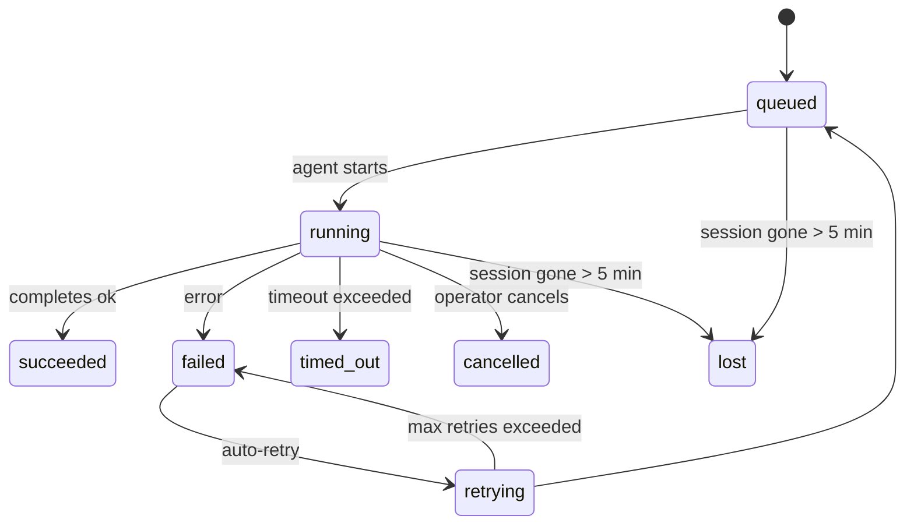

# OpenClaw 大任务拆分与编排执行机制详解

## 📋 目录

- [1. 概述](#1-概述)
- [2. 核心架构设计](#2-核心架构设计)
- [3. 任务拆分策略](#3-任务拆分策略)
- [4. 编排执行流程](#4-编排执行流程)
- [5. Lane 队列管理](#5-lane-队列管理)
- [6. 子代理系统](#6-子代理系统)
- [7. TaskFlow 流式编排](#7-taskflow-流式编排)
- [8. Cron 定时调度](#8-cron-定时调度)
- [9. 错误处理与重试](#9-错误处理与重试)
- [10. 核心文件清单](#10-核心文件清单)
- [11. 典型使用场景](#11-典型使用场景)

---

## 1. 概述

OpenClaw 的任务编排机制是一个**多层次、智能化的自动化系统**，它能够将复杂的大任务智能拆分为可管理的子任务，通过 Agent 协作和队列调度实现高效并行执行。

### 1.1 核心能力

- **🎯 智能任务拆分**：基于 LLM 的自主任务分解与规划
- **🤖 Agent 协作**：主代理动态派生子代理并行处理
- **🔀 并发控制**：Lane 队列管理系统资源竞争与隔离
- **⏰ 定时调度**：Cron 表达式驱动的周期性任务执行
- **🌊 流式编排**：TaskFlow 多步骤工作流管理与状态跟踪
- **🛡️ 容错机制**：指数退避重试、模型回退、失败告警、超时保护

### 1.2 设计原则

```
┌─────────────────────────────────────────────┐
│          OpenClaw 任务编排设计原则            │
├─────────────────────────────────────────────┤
│ • Local-first: 本地优先，数据主权             │
│ • Plugin-based: 插件化扩展                    │
│ • Event-driven: 事件驱动架构                  │
│ • Fault-tolerant: 容错与自愈                  │
│ • Observable: 可观测性与诊断                  │
│ • Scalable: 水平扩展支持                      │
└─────────────────────────────────────────────┘
```

---

## 2. 核心架构设计

### 2.1 分层架构

OpenClaw 采用**五层架构**来实现任务从接收、拆分、编排到执行的完整流程：

```
┌──────────────────────────────────────────────────┐
│              User / External Trigger               │
│         (Chat, Cron, Webhook, API Call)           │
└────────────────────┬─────────────────────────────┘
                     │
                     ▼
┌──────────────────────────────────────────────────┐
│              Task Flow Layer                       │
│   (Multi-step workflow orchestration)             │
│   src/tasks/task-flow-registry.ts                 │
│                                                   │
│   职责：                                          │
│   • 管理工作流整体状态                             │
│   • 跟踪多步骤执行进度                             │
│   • 处理阻塞与等待条件                             │
└────────────────────┬─────────────────────────────┘
                     │
                     ▼
┌──────────────────────────────────────────────────┐
│              Task Registry Layer                   │
│   (Background task tracking & lifecycle)          │
│   src/tasks/task-registry.ts                      │
│                                                   │
│   职责：                                          │
│   • 跟踪后台任务生命周期                           │
│   • 管理任务状态转换                               │
│   • 提供任务审计与查询                             │
└────────────────────┬─────────────────────────────┘
                     │
                     ▼
┌──────────────────────────────────────────────────┐
│              Agent Execution Layer                 │
│   (LLM reasoning + tool execution)                │
│   src/agents/pi-embedded-runner/run.ts            │
│                                                   │
│   职责：                                          │
│   • 执行 LLM 推理循环                              │
│   • 调用工具获取结果                               │
│   • 处理上下文压缩                                 │
└────────────────────┬─────────────────────────────┘
                     │
                     ▼
┌──────────────────────────────────────────────────┐
│              Subagent System                       │
│   (Parallel task decomposition)                   │
│   src/agents/subagent-spawn.ts                    │
│                                                   │
│   职责：                                          │
│   • 动态创建子代理会话                             │
│   • 管理父子代理关系                               │
│   • 传递上下文与附件                               │
└────────────────────┬─────────────────────────────┘
                     │
                     ▼
┌──────────────────────────────────────────────────┐
│              Lane Queue Manager                    │
│   (Concurrency control & isolation)               │
│   src/process/command-queue.ts                    │
│                                                   │
│   职责：                                          │
│   • 序列化命令执行                                 │
│   • 管理并发限制                                   │
│   • 隔离不同任务类型                               │
└──────────────────────────────────────────────────┘
```

### 2.2 关键组件映射

| 层级 | 组件 | 核心文件 | 职责 |
|------|------|---------|------|
| **触发层** | Channel Monitor | `src/channels/` | 接收外部消息并路由 |
| **触发层** | Cron Timer | `src/cron/service/timer.ts` | 定时触发任务 |
| **编排层** | TaskFlow Registry | `src/tasks/task-flow-registry.ts` | 管理工作流状态 |
| **编排层** | Task Registry | `src/tasks/task-registry.ts` | 跟踪任务生命周期 |
| **执行层** | Pi Embedded Runner | `src/agents/pi-embedded-runner/run.ts` | Agent 执行引擎 |
| **执行层** | Subagent Spawn | `src/agents/subagent-spawn.ts` | 子代理派生 |
| **调度层** | Command Queue | `src/process/command-queue.ts` | Lane 队列管理 |
| **工具层** | Tools | `src/agents/tools/` | 各种工具实现 |

---

## 3. 任务拆分策略

### 3.1 拆分维度

OpenClaw 支持多种任务拆分方式，根据任务复杂度自动选择最优策略：

#### 3.1.1 基于 Agent 能力的智能拆分

主 Agent 在执行过程中，通过 LLM 分析任务复杂度并决定是否需要拆分：

```typescript
// 伪代码示例
const complexity = await analyzeTaskComplexity(task);

if (complexity > THRESHOLD) {
  // 拆分为多个子任务
  const subtasks = await decomposeTask(task);
  
  // 并行执行子任务
  for (const subtask of subtasks) {
    spawnSubagent({ 
      task: subtask,
      model: selectOptimalModel(subtask),
      context: forkContext()
    });
  }
}
```

**拆分决策因素：**
- 任务描述的长度和复杂度
- 所需工具调用的数量
- 预期执行时间
- 上下文窗口限制

#### 3.1.2 基于工具调用的显式拆分

Agent 可以通过特定工具主动进行任务分解：

**sessions_spawn 工具**（最核心的拆分机制）：
```typescript
interface SessionsSpawnParams {
  task: string;              // 必需：任务描述
  label?: string;            // 可选：任务标签
  runtime?: "subagent" | "acp";  // 运行时类型
  agentId?: string;          // 目标 Agent ID
  model?: string;            // 模型覆盖
  thinking?: string;         // 思考级别
  runTimeoutSeconds?: number;// 超时时间
  thread?: boolean;          // 线程绑定
  mode?: "run" | "session";  // 运行模式
  cleanup?: "delete" | "keep"; // 清理策略
  sandbox?: "inherit" | "require"; // 沙箱模式
  context?: "isolated" | "fork"; // 上下文模式
  attachments?: Attachment[]; // 附件传递
}
```

**llm-task 工具**（用于 Lobster 工作流）：
```typescript
interface LlmTaskParams {
  prompt: string;            // 任务指令
  input?: unknown;           // 输入负载
  schema?: unknown;          // JSON Schema 验证
  provider?: string;         // Provider 覆盖
  model?: string;            // Model 覆盖
  thinking?: string;         // 思考级别
  timeoutMs?: number;        // 超时时间
}
```

#### 3.1.3 基于上下文的自动拆分

当上下文长度接近模型限制时，自动触发**上下文压缩**或**任务分段**：

```typescript
// src/agents/pi-embedded-runner/compact.ts
async function compactContext(params: CompactParams): Promise<CompactResult> {
  // 1. 保留最近的消息
  const recentMessages = messages.slice(-RECENT_MESSAGE_COUNT);
  
  // 2. 压缩历史消息为摘要
  const summary = await summarizeHistory({
    messages: oldMessages,
    model: compressionModel,
  });
  
  // 3. 构建新的上下文
  return [
    { role: "system", content: summary },
    ...recentMessages,
  ];
}
```

### 3.2 sessions_spawn 深度解析

这是**最核心的任务拆分机制**，允许 Agent 动态创建子代理。

#### 执行流程

```
父 Agent 调用 sessions_spawn
    ↓
验证深度限制（默认 maxDepth=2）
    ↓
检查并发限制（maxChildrenPerAgent）
    ↓
解析工作空间继承
    ↓
创建子会话（childSessionKey）
    ↓
注册到 Subagent Registry
    ↓
发射 lifecycle.create 事件
    ↓
触发 subagent_spawning Hook
    ↓
在独立 Lane 中执行子任务
    ↓
子 Agent 完成
    ↓
captureSubagentCompletionReply
    ↓
发送 announce 到父会话
    ↓
标记为完成并清理（如 cleanup="delete"）
```

#### 深度与并发限制

```typescript
// src/agents/subagent-spawn.ts

// 深度限制防止无限递归
const maxDepth = cfg.agents?.defaults?.subagentMaxDepth ?? 2;
const currentDepth = calculateSpawnDepth(requesterSessionKey);

if (currentDepth >= maxDepth) {
  return {
    status: "forbidden",
    error: `Maximum spawn depth (${maxDepth}) reached`,
  };
}

// 并发限制防止资源耗尽
const maxChildren = cfg.agents?.defaults?.subagents?.maxChildrenPerAgent ?? 5;
const activeChildren = countActiveChildren(requesterSessionKey);

if (activeChildren >= maxChildren) {
  return {
    status: "forbidden",
    error: `Max active children reached (${activeChildren}/${maxChildren})`,
  };
}
```

### 3.3 OpenProse 语法中的任务拆分

OpenProse 提供了一种声明式的任务编排语言：

```prose
# 定义专用 Agent
agent researcher:
  model: opus
  prompt: "You are a research expert"

agent writer:
  model: sonnet
  prompt: "You are a technical writer"

# 并行执行多个子任务
parallel:
  research = session: researcher
    prompt: "Research quantum computing trends"
  
  analysis = session: analyst
    prompt: "Analyze market data"

# 整合结果
output report = session: writer
  prompt: "Synthesize research and analysis"
  context: { research, analysis }
```

**编译后的执行逻辑：**
```typescript
// 并行启动所有 session
const [research, analysis] = await Promise.all([
  Task({
    description: "OpenProse session",
    prompt: "Research quantum computing trends\n\nSystem: You are a research expert",
    subagent_type: "general-purpose",
    model: "opus"
  }),
  Task({
    description: "OpenProse session",
    prompt: "Analyze market data",
    subagent_type: "general-purpose"
  })
]);

// 整合结果
const report = await Task({
  description: "OpenProse session",
  prompt: "Synthesize research and analysis",
  context: { research, analysis }
});
```

---

## 4. 编排执行流程

### 4.1 完整执行链路



### 4.2 Agent 执行引擎核心流程

核心文件：[`src/agents/pi-embedded-runner/run.ts`](file:///Users/sunshoucai/vscodeProjects/openclaw/src/agents/pi-embedded-runner/run.ts)

#### 执行步骤详解

```typescript
export async function runEmbeddedPiAgent(
  params: RunEmbeddedPiAgentParams
): Promise<EmbeddedPiRunResult> {
  
  // ========== 阶段 1: 初始化 ==========
  
  // 1.1 解析工作空间
  const workspaceResolution = resolveRunWorkspaceDir({
    workspaceDir: params.workspaceDir,
    sessionKey: params.sessionKey,
    agentId: params.agentId,
  });
  
  // 1.2 加载运行时插件
  ensureRuntimePluginsLoaded({
    config: params.config,
    workspaceDir: resolvedWorkspace,
  });
  
  // 1.3 触发 Hook（before_agent_start）
  await hookRunner.runBeforeAgentStart(hookCtx);
  
  // ========== 阶段 2: 执行循环 ==========
  
  let retryCount = 0;
  const maxRetries = resolveMaxRunRetryIterations(params);
  
  while (retryCount < maxRetries) {
    try {
      // 2.1 构建请求 payloads
      const payloads = buildEmbeddedRunPayloads({
        prompt: params.prompt,
        images: params.images,
        messages: session.messages,
      });
      
      // 2.2 执行单次尝试
      const attemptResult = await runEmbeddedAttemptWithBackend({
        payloads,
        provider: params.provider,
        modelId: params.modelId,
        tools: createOpenClawTools({...}),
        timeoutMs: params.timeoutMs,
      });
      
      // 2.3 处理流式输出和工具调用
      const processed = processAttemptResult(attemptResult);
      
      // 2.4 检查是否需要重试
      if (shouldRetry(processed)) {
        retryCount++;
        continue;
      }
      
      // 2.5 返回成功结果
      return processed;
      
    } catch (error) {
      // 2.6 错误处理
      if (isRetryableError(error) && retryCount < maxRetries) {
        await sleepWithAbort(backoffDelay(retryCount));
        retryCount++;
        continue;
      }
      throw error;
    }
  }
  
  // ========== 阶段 3: 清理 ==========
  
  // 3.1 触发 Hook（after_agent_end）
  await hookRunner.runAfterAgentEnd(hookCtx);
  
  // 3.2 更新任务状态
  completeTaskRunByRunId(runId, { status: "succeeded" });
}
```

### 4.3 工具调用与结果处理

Agent 在执行过程中可以调用各种工具：

```typescript
// 工具调用流程
Agent Loop
    ↓
LLM 生成工具调用请求
    ↓
验证工具参数
    ↓
执行 before_tool_call Hook
    ↓
调用工具实现
    ↓
截断过大的结果（如果需要）
    ↓
执行 after_tool_call Hook
    ↓
将结果添加到会话历史
    ↓
继续下一轮 LLM 推理
```

**关键工具类型：**
- **Shell 工具**：执行命令
- **Browser 工具**：网页浏览
- **MCP 工具**：Model Context Protocol
- **sessions_spawn**：创建子代理
- **llm-task**：通用 LLM 任务
- **openclaw.invoke**：调用 Lobster 工作流

---

## 5. Lane 队列管理

### 5.1 Lane 的概念

**Lane** 是 OpenClaw 的并发控制机制，类似于游泳池的泳道，每个 Lane 可以独立执行任务而不会相互干扰。

核心文件：[`src/process/command-queue.ts`](file:///Users/sunshoucai/vscodeProjects/openclaw/src/process/command-queue.ts)

### 5.2 Lane 类型

```typescript
// src/process/lanes.ts
export enum CommandLane {
  Main = "main",              // 主 Lane：交互式对话
  Subagent = "subagent",      // 子代理 Lane
  Cron = "cron",              // 定时任务 Lane
  Media = "media",            // 媒体生成 Lane
  Background = "background",  // 后台任务 Lane
}
```

### 5.3 队列管理实现

```typescript
type LaneState = {
  lane: string;
  queue: QueueEntry[];        // 等待队列
  activeTaskIds: Set<number>; // 正在执行的任务
  maxConcurrent: number;      // 最大并发数
  draining: boolean;          // 是否正在排空
  generation: number;         // 代际编号（用于清理）
};

type QueueEntry = {
  task: () => Promise<unknown>;
  resolve: (value: unknown) => void;
  reject: (reason?: unknown) => void;
  enqueuedAt: number;
  warnAfterMs: number;
  onWait?: (waitMs: number, queuedAhead: number) => void;
};
```

#### 入队流程

```typescript
export async function enqueueCommandInLane<T>(
  lane: string,
  task: () => Promise<T>,
  options?: EnqueueOptions
): Promise<T> {
  const normalizedLane = normalizeLane(lane);
  const state = getLaneState(normalizedLane);
  
  // 检查网关是否正在排空
  if (getQueueState().gatewayDraining) {
    throw new GatewayDrainingError();
  }
  
  // 创建任务条目
  const taskId = getNextTaskId();
  const entry: QueueEntry = {
    task,
    resolve: undefined!,
    reject: undefined!,
    enqueuedAt: Date.now(),
    warnAfterMs: options?.warnAfterMs ?? 30000,
  };
  
  // 包装为 Promise
  return new Promise((resolve, reject) => {
    entry.resolve = resolve;
    entry.reject = reject;
    
    // 加入队列
    state.queue.push(entry);
    
    // 日志记录
    logLaneEnqueue({ lane: normalizedLane, taskId });
    
    // 尝试执行
    processLaneQueue(state);
  });
}
```

#### 出队与执行流程

```typescript
function processLaneQueue(state: LaneState): void {
  // 如果正在排空，不处理新任务
  if (state.draining) {
    return;
  }
  
  // 检查并发限制
  if (state.activeTaskIds.size >= state.maxConcurrent) {
    return;
  }
  
  // 取出下一个任务
  const entry = state.queue.shift();
  if (!entry) {
    return;
  }
  
  const taskId = getNextTaskId();
  state.activeTaskIds.add(taskId);
  
  // 异步执行任务
  (async () => {
    try {
      const result = await entry.task();
      entry.resolve(result);
    } catch (error) {
      // 忽略预期的非错误失败
      if (!isExpectedNonErrorLaneFailure(error)) {
        entry.reject(error);
      }
    } finally {
      // 清理
      completeTask(state, taskId, state.generation);
      
      // 继续处理队列
      processLaneQueue(state);
    }
  })();
}
```

### 5.4 Lane 隔离优势

1. **资源隔离**：不同类型的任务不会相互阻塞
2. **优先级控制**：可以为不同 Lane 设置不同的并发限制
3. **故障隔离**：一个 Lane 的故障不会影响其他 Lane
4. **可观测性**：可以单独监控每个 Lane 的状态

---

## 6. 子代理系统

### 6.1 子代理架构

子代理系统是 OpenClaw 实现**并行任务处理**的核心机制。

核心文件：
- [`src/agents/subagent-spawn.ts`](file:///Users/sunshoucai/vscodeProjects/openclaw/src/agents/subagent-spawn.ts) - 子代理派生
- [`src/agents/subagent-registry.ts`](file:///Users/sunshoucai/vscodeProjects/openclaw/src/agents/subagent-registry.ts) - 子代理注册表
- [`src/agents/subagent-announce.ts`](file:///Users/sunshoucai/vscodeProjects/openclaw/src/agents/subagent-announce.ts) - 结果通知

### 6.2 子代理生命周期

```
创建阶段
    ↓
spawnSubagent() 调用
    ↓
验证深度和并发限制
    ↓
创建子会话（forkSessionFromParent）
    ↓
注册到 SubagentRegistry
    ↓
发射 lifecycle.create 事件
    ↓
执行阶段
    ↓
在独立 Lane 中执行
    ↓
调用工具和 LLM
    ↓
完成阶段
    ↓
captureSubagentCompletionReply()
    ↓
发送 announce 到父会话
    ↓
清理阶段（可选）
    ↓
标记为完成
    ↓
删除会话（如 cleanup="delete"）
```

### 6.3 上下文继承策略

子代理可以以不同方式继承父代理的上下文：

```typescript
type SpawnSubagentContextMode = 
  | "isolated"   // 完全隔离，无上下文
  | "fork";      // 分叉，继承部分上下文

// 上下文分叉实现
async function forkSessionFromParent(params: {
  parentSessionKey: string;
  childSessionKey: string;
  maxTokens?: number;
}): Promise<void> {
  // 1. 获取父会话消息
  const parentMessages = await getSessionMessages(parentSessionKey);
  
  // 2. 选择要继承的消息（通常是最近的 N 条）
  const inheritedMessages = selectMessagesForFork(
    parentMessages,
    params.maxTokens
  );
  
  // 3. 创建子会话并注入消息
  await createSession({
    sessionKey: params.childSessionKey,
    messages: inheritedMessages,
  });
}
```

### 6.4 子代理通信机制

子代理完成后，通过 **announce** 机制向父代理报告结果：

```typescript
// src/agents/subagent-announce.ts
export async function announceSubagentCompletion(params: {
  parentSessionKey: string;
  childSessionKey: string;
  result: SubagentResult;
}): Promise<void> {
  // 1. 格式化结果消息
  const message = formatAnnounceMessage({
    childLabel: params.result.label,
    summary: params.result.summary,
    attachments: params.result.attachments,
  });
  
  // 2. 发送到父会话
  await sendMessageToSession({
    sessionKey: params.parentSessionKey,
    message,
    attachments: params.result.attachments,
  });
  
  // 3. 发射事件
  emitEvent("subagent.announce", {
    parentSessionKey: params.parentSessionKey,
    childSessionKey: params.childSessionKey,
  });
}
```

---

## 7. TaskFlow 流式编排

### 7.1 什么是 TaskFlow？

**TaskFlow** 是位于后台任务之上的**流式编排层**，管理持久的多步骤工作流，具有自己的状态、版本跟踪和同步语义。

核心文件：[`src/tasks/task-flow-registry.ts`](file:///Users/sunshoucai/vscodeProjects/openclaw/src/tasks/task-flow-registry.ts)

### 7.2 使用场景对比

| 场景 | 使用 | 说明 |
|------|------|------|
| 单步后台任务 | 普通 Task | 简单的背景操作 |
| 多步流水线（A→B→C） | TaskFlow（托管） | 需要状态跟踪的工作流 |
| 观察外部创建的任务 | TaskFlow（镜像） | 同步外部任务状态 |
| 一次性提醒 | Cron Job | 定时触发 |

### 7.3 TaskFlow 记录结构

```typescript
interface TaskFlowRecord {
  flowId: string;                    // 工作流 ID
  ownerKey: string;                  // 所有者 session key
  status: TaskFlowStatus;            // running, completed, failed, cancelled
  notifyPolicy: TaskNotifyPolicy;    // 通知策略
  goal: string;                      // 工作目标
  currentStep?: string;              // 当前步骤
  blockedTaskId?: string;            // 阻塞的任务 ID
  blockedSummary?: string;           // 阻塞原因摘要
  controllerId?: string;             // 控制器 ID
  stateJson?: JsonValue;             // 自定义状态
  waitJson?: JsonValue;              // 等待条件
  syncMode: TaskFlowSyncMode;        // managed, mirrored
  revision: number;                  // 版本号（乐观锁）
  createdAt: number;
  updatedAt: number;
  endedAt?: number;
}
```

### 7.4 可靠的工作流模式

对于定期工作流（如市场情报简报），将调度、编排和可靠性检查作为独立层：

1. **Scheduled Tasks**：使用 Cron 进行定时
2. **Persistent Session**：使用持久化 cron session 构建先前的上下文
3. **Lobster Workflows**：使用 Lobster 进行确定性步骤、审批门和恢复令牌
4. **TaskFlow**：使用 TaskFlow 跟踪跨子任务、等待、重试和网关重启的多步骤运行

#### 示例：市场情报简报工作流

```bash
# 创建定时任务
openclaw cron add \
  --name "Market intelligence brief" \
  --cron "0 7 * * 1-5" \
  --tz "America/New_York" \
  --session session:market-intel \
  --message "Run the market-intel Lobster workflow. Verify source freshness before summarizing." \
  --announce \
  --channel slack \
  --to "channel:C1234567890"
```

```yaml
# Lobster 工作流定义
name: market-intel-brief
steps:
  - id: preflight
    command: market-intel check --json
    description: "检查数据源新鲜度"
    
  - id: collect
    command: market-intel collect --json
    stdin: $preflight.json
    description: "收集市场数据"
    
  - id: summarize
    command: market-intel summarize --json
    stdin: $collect.json
    description: "生成摘要"
    
  - id: approve
    command: market-intel deliver --preview
    stdin: $summarize.json
    approval: required
    description: "人工审批"
    
  - id: deliver
    command: market-intel deliver --execute
    stdin: $summarize.json
    condition: $approve.approved
    description: "发送报告"
```

### 7.5 TaskFlow 状态机



---

## 8. Cron 定时调度

### 8.1 Cron 系统架构

Cron 系统是 OpenClaw 的**定时任务调度引擎**，负责周期性任务的触发和执行。

核心文件：
- [`src/cron/service/ops.ts`](file:///Users/sunshoucai/vscodeProjects/openclaw/src/cron/service/ops.ts) - CRUD 操作
- [`src/cron/service/timer.ts`](file:///Users/sunshoucai/vscodeProjects/openclaw/src/cron/service/timer.ts) - 定时器与执行
- [`src/cron/service/jobs.ts`](file:///Users/sunshoucai/vscodeProjects/openclaw/src/cron/service/jobs.ts) - 任务模型

### 8.2 Cron 任务结构

```typescript
interface CronJob {
  id: string;                    // 任务 ID
  name: string;                  // 任务名称
  schedule: CronSchedule;        // 调度配置
  enabled: boolean;              // 是否启用
  session: CronSessionConfig;    // 会话配置
  message: string;               // 执行消息
  delivery: DeliveryConfig;      // 投递配置
  state: CronJobState;           // 运行时状态
  createdAtMs: number;
  updatedAtMs: number;
}

interface CronSchedule {
  kind: "cron" | "at";          // cron 表达式或一次性
  cron?: string;                 // cron 表达式（如 "0 7 * * 1-5"）
  timezone?: string;             // 时区
  at?: number;                   // 一次性时间戳
}

interface CronJobState {
  lastRunAtMs?: number;          // 上次执行时间
  lastRunStatus?: "success" | "error"; // 上次执行状态
  lastError?: string;            // 最后错误信息
  consecutiveErrors: number;     // 连续错误次数
  nextRunAtMs?: number;          // 下次执行时间
  runningAtMs?: number;          // 当前运行时间
}
```

### 8.3 Cron 执行流程

```typescript
// src/cron/service/timer.ts
async function executeJobCoreWithTimeout(params: {
  job: CronJob;
  nowMs: number;
}): Promise<CronExecutionResult> {
  const { job } = params;
  
  // 1. 创建任务记录
  const taskRun = createRunningTaskRun({
    type: "cron",
    jobId: job.id,
    sessionKey: job.session.key,
  });
  
  try {
    // 2. 在 Cron Lane 中执行
    const result = await enqueueCommandInLane(CommandLane.Cron, async () => {
      // 2.1 解析会话
      const sessionKey = resolveSessionKey(job.session);
      
      // 2.2 执行 Agent
      const agentResult = await runEmbeddedPiAgent({
        sessionKey,
        prompt: job.message,
        // ... 其他参数
      });
      
      return agentResult;
    });
    
    // 3. 标记任务成功
    completeTaskRunByRunId(taskRun.runId, {
      status: "succeeded",
    });
    
    return { status: "success" };
    
  } catch (error) {
    // 4. 标记任务失败
    failTaskRunByRunId(taskRun.runId, {
      error: formatErrorMessage(error),
    });
    
    return { 
      status: "error",
      error: formatErrorMessage(error),
    };
  }
}
```

### 8.4 定时器管理

```typescript
// 定时器循环
async function timerLoop(state: CronServiceState): Promise<void> {
  while (!state.stopped) {
    const nowMs = state.deps.nowMs();
    
    // 1. 查找需要执行的任务
    const dueJobs = findDueJobs(state.store.jobs, nowMs);
    
    // 2. 执行错过的任务
    if (dueJobs.length > 0) {
      await runMissedJobs({
        jobs: dueJobs,
        nowMs,
        state,
      });
    }
    
    // 3. 计算下次唤醒时间
    const nextWake = nextWakeAtMs(state.store.jobs);
    
    // 4. 设置定时器
    if (nextWake) {
      const delay = Math.max(0, nextWake - nowMs);
      await sleep(delay);
    } else {
      await sleep(DEFAULT_CHECK_INTERVAL);
    }
  }
}
```

### 8.5 错误处理与重试

```typescript
// 指数退避重试
function computeNextRunAfterError(job: CronJob, nowMs: number): number {
  const consecutiveErrors = job.state.consecutiveErrors ?? 0;
  
  // 基础延迟：1分钟
  const baseDelayMs = 60_000;
  
  // 指数增长：1min, 2min, 4min, 8min, 16min, 最大32min
  const exponentialDelay = baseDelayMs * Math.pow(2, consecutiveErrors);
  const cappedDelay = Math.min(exponentialDelay, 32 * 60_000);
  
  return nowMs + cappedDelay;
}
```

---

## 9. 错误处理与重试

### 9.1 多层重试策略

OpenClaw 实现了**多层重试机制**，从 Agent 级别到模型级别都有完善的容错：

#### 9.1.1 Agent 执行重试

```typescript
// src/agents/pi-embedded-runner/run.ts
const MAX_RUN_RETRY_ITERATIONS = 3;

async function runWithRetry(params: RunParams): Promise<RunResult> {
  let retryCount = 0;
  
  while (retryCount < MAX_RUN_RETRY_ITERATIONS) {
    try {
      return await runEmbeddedAttempt(params);
    } catch (error) {
      if (!isRetryableError(error)) {
        throw error;
      }
      
      retryCount++;
      
      // 指数退避
      const delay = calculateBackoff(retryCount);
      await sleepWithAbort(delay, params.abortSignal);
    }
  }
  
  throw new Error(`Max retries exceeded (${MAX_RUN_RETRY_ITERATIONS})`);
}
```

#### 9.1.2 模型回退策略

```typescript
// src/agents/model-fallback.ts
interface ModelFallbackPlan {
  primary: ModelRef;
  fallbacks: ModelRef[];
}

async function executeWithFallback(
  params: ExecuteParams,
  fallbackPlan: ModelFallbackPlan
): Promise<ExecuteResult> {
  const models = [fallbackPlan.primary, ...fallbackPlan.fallbacks];
  
  for (const model of models) {
    try {
      return await executeWithModel({
        ...params,
        model,
      });
    } catch (error) {
      if (!isFailoverError(error)) {
        throw error;
      }
      
      log.warn(`Model ${model} failed, trying next fallback`);
    }
  }
  
  throw new Error("All models failed");
}
```

### 9.2 错误分类

```typescript
type FailoverReason =
  | "context_overflow"      // 上下文溢出
  | "rate_limit"            // 速率限制
  | "auth_failure"          // 认证失败
  | "billing_error"         // 计费错误
  | "model_unavailable"     // 模型不可用
  | "timeout"               // 超时
  | "network_error";        // 网络错误

function classifyFailoverError(error: Error): FailoverReason {
  if (isContextOverflowError(error)) {
    return "context_overflow";
  }
  if (isRateLimitError(error)) {
    return "rate_limit";
  }
  if (isAuthError(error)) {
    return "auth_failure";
  }
  // ... 其他分类
  return "network_error";
}
```

### 9.3 任务状态转换



### 9.4 自动维护

任务注册表每 **60 秒**运行一次清理器，处理三件事：

1. **Reconciliation**: 检查活动任务是否仍有权威运行时支持
2. **Cleanup stamping**: 在终端任务上设置 `cleanupAfter` 时间戳（endedAt + 7 天）
3. **Pruning**: 删除超过 `cleanupAfter` 日期的记录

**保留策略**：终端任务记录保留 **7 天**，然后自动修剪。

---

## 10. 核心文件清单

### 10.1 任务调度层

| 文件 | 路径 | 职责 |
|------|------|------|
| **Cron Ops** | `src/cron/service/ops.ts` | Cron 定时任务执行引擎 |
| **Cron Timer** | `src/cron/service/timer.ts` | 定时器管理和任务触发 |
| **Cron Jobs** | `src/cron/service/jobs.ts` | 任务定义和状态管理 |
| **Command Queue** | `src/process/command-queue.ts` | Lane 队列管理器 |
| **Lanes** | `src/process/lanes.ts` | Lane 类型定义 |

### 10.2 Agent 执行层

| 文件 | 路径 | 职责 |
|------|------|------|
| **Pi Runner** | `src/agents/pi-embedded-runner/run.ts` | Agent 执行引擎（核心） |
| **Compaction** | `src/agents/pi-embedded-runner/compact.ts` | 上下文压缩机制 |
| **Lanes** | `src/agents/pi-embedded-runner/lanes.ts` | Session Lane 解析 |
| **Context Maintenance** | `src/agents/pi-embedded-runner/context-engine-maintenance.ts` | 后台维护任务 |
| **Model Fallback** | `src/agents/model-fallback.ts` | 模型回退策略 |

### 10.3 子代理系统

| 文件 | 路径 | 职责 |
|------|------|------|
| **Subagent Spawn** | `src/agents/subagent-spawn.ts` | 子代理派生系统 |
| **Subagent Registry** | `src/agents/subagent-registry.ts` | 子代理注册表 |
| **Subagent Announce** | `src/agents/subagent-announce.ts` | 子代理结果通知 |
| **Sessions Spawn Tool** | `src/agents/tools/sessions-spawn-tool.ts` | sessions_spawn 工具实现 |

### 10.4 任务流编排层

| 文件 | 路径 | 职责 |
|------|------|------|
| **TaskFlow Registry** | `src/tasks/task-flow-registry.ts` | TaskFlow 注册表 |
| **Task Registry** | `src/tasks/task-registry.ts` | 任务注册表 |
| **Detached Task Runtime** | `src/tasks/detached-task-runtime.ts` | 分离任务运行时 |
| **Task Owner Access** | `src/tasks/task-owner-access.ts` | 任务所有者访问控制 |

### 10.5 工具层

| 文件 | 路径 | 职责 |
|------|------|------|
| **LLM Task Tool** | `extensions/llm-task/src/llm-task-tool.ts` | LLM Task 工具 |
| **Pi Tools** | `src/agents/pi-tools.*` | 各种工具实现 |
| **Tool Wrappers** | `src/agents/pi-tools.abort.ts` | 工具包装器（中止支持） |
| **Tool Wrappers** | `src/agents/pi-tools.before-tool-call.ts` | 工具包装器（Hook 支持） |

### 10.6 工作空间管理

| 文件 | 路径 | 职责 |
|------|------|------|
| **Workspace Run** | `src/agents/workspace-run.ts` | 工作空间解析 |
| **Agent Scope** | `src/agents/agent-scope.ts` | Agent 作用域管理 |
| **Agent Paths** | `src/agents/agent-paths.ts` | Agent 路径管理 |

### 10.7 上下文引擎

| 文件 | 路径 | 职责 |
|------|------|------|
| **Context Engine Types** | `src/context-engine/types.ts` | 上下文引擎接口定义 |
| **Context Engine Registry** | `src/context-engine/registry.ts` | 上下文引擎注册表 |
| **Context Engine Init** | `src/context-engine/init.ts` | 上下文引擎初始化 |

---

## 11. 典型使用场景

### 场景 1：研究任务分解

```prose
# 主 Agent 接收复杂研究任务
agent researcher:
  model: opus
  prompt: "You are a research expert"

# 第一步：分解任务
let plan = session: researcher
  prompt: "Break down this research topic into subtopics"

# 第二步：并行研究各个子主题
parallel:
  subtopic1 = session: researcher
    prompt: "Research subtopic 1 in depth"
  
  subtopic2 = session: researcher
    prompt: "Research subtopic 2 in depth"
  
  subtopic3 = session: researcher
    prompt: "Research subtopic 3 in depth"

# 第三步：综合结果
output final_report = session: researcher
  prompt: "Synthesize all subtopic research into a comprehensive report"
  context: { plan, subtopic1, subtopic2, subtopic3 }
```

**执行流程：**
1. 主 Agent 分析任务并生成研究计划
2. 并行创建 3 个子代理，每个负责一个子主题
3. 子代理在独立的 Lane 中执行研究任务
4. 子代理完成后通过 announce 返回结果
5. 主 Agent 整合所有结果生成最终报告

### 场景 2：代码审查工作流

```prose
agent reviewer:
  model: sonnet
  prompt: "You are an expert code reviewer"

# 并行审查不同模块
parallel:
  api_review = session: reviewer
    prompt: "Review the API layer code in src/api/"
  
  db_review = session: reviewer
    prompt: "Review the database layer code in src/db/"
  
  ui_review = session: reviewer
    prompt: "Review the UI components in src/components/"

# 汇总审查结果
output review_summary = session: reviewer
  prompt: "Create a consolidated code review summary"
  context: { api_review, db_review, ui_review }
```

**优势：**
- 并行执行，缩短总耗时
- 每个子代理专注特定模块
- 最终汇总提供全局视角

### 场景 3：定时数据管道

```bash
# 创建每日数据简报任务
openclaw cron add \
  --name "Daily Data Brief" \
  --cron "0 8 * * *" \
  --tz "Asia/Shanghai" \
  --session session:data-brief \
  --message "Run the data pipeline: fetch → transform → analyze → report"
```

```yaml
# Lobster 工作流定义
name: data-pipeline
steps:
  - id: fetch
    command: data-fetch --sources all --json
    description: "从所有数据源获取数据"
    
  - id: transform
    command: data-transform --input $fetch.json --json
    description: "转换数据格式"
    
  - id: analyze
    command: data-analyze --input $transform.json --json
    description: "分析数据趋势"
    
  - id: report
    command: data-report --input $analyze.json --format markdown
    description: "生成 Markdown 报告"
    
  - id: deliver
    command: send-report --file $report.md --channel slack
    description: "发送报告到 Slack"
```

**执行流程：**
1. Cron 定时器每天 8:00 触发任务
2. 在 Cron Lane 中执行 Lobster 工作流
3. 每个步骤依次执行，前一步的输出作为后一步的输入
4. 最终报告发送到 Slack 频道
5. TaskFlow 跟踪整个工作流状态

### 场景 4：多模型协同

```prose
# 使用不同模型处理不同难度的任务
agent planner:
  model: opus
  prompt: "You excel at complex planning"

agent executor:
  model: sonnet
  prompt: "You execute tasks efficiently"

agent formatter:
  model: haiku
  prompt: "You format output quickly"

# 复杂规划使用 Opus
let plan = session: planner
  prompt: "Design a comprehensive strategy"

# 具体执行使用 Sonnet
let results = session: executor
  prompt: "Execute the planned tasks"
  context: plan

# 简单格式化使用 Haiku
output formatted = session: formatter
  prompt: "Format the results"
  context: results
```

**成本优化：**
- Opus：用于高难度推理（昂贵但强大）
- Sonnet：用于常规任务（性价比高）
- Haiku：用于简单任务（快速便宜）

---

## 总结

OpenClaw 的任务编排机制通过以下核心设计实现了强大的任务管理能力：

### 核心优势

1. **分层架构**：从 TaskFlow → Task → Agent → Subagent → Tool 的清晰分层
2. **智能拆分**：基于 LLM 的自主任务分解和 sessions_spawn 工具
3. **并发控制**：Lane 队列系统确保资源合理分配和隔离
4. **容错机制**：多层重试、模型回退、指数退避
5. **持久化状态**：TaskFlow 和 Task Registry 提供可靠的状态跟踪
6. **灵活调度**：Cron 系统支持复杂的定时任务场景
7. **可观测性**：完整的任务生命周期跟踪和审计

### 适用场景

✅ **适合的场景：**
- 复杂的研究和分析任务
- 多步骤的数据处理管道
- 并行的代码审查和质量检查
- 定时报告和监控任务
- 需要人工审批的工作流

❌ **不适合的场景：**
- 实时性要求极高的任务（秒级响应）
- 需要严格事务一致性的操作
- 超大规模分布式计算（考虑专用框架）

### 最佳实践

1. **合理设置深度限制**：避免过深的子代理嵌套（建议 maxDepth=2-3）
2. **选择合适的模型**：根据任务难度选择 Opus/Sonnet/Haiku
3. **使用 Lane 隔离**：将不同类型任务分配到不同 Lane
4. **监控任务状态**：定期检查 TaskFlow 和 Task Registry
5. **配置重试策略**：为关键任务设置合理的重试次数和退避时间
6. **清理无用会话**：及时清理已完成的子代理会话

这套机制使得 OpenClaw 能够高效地处理从简单的一次性任务到复杂的多步骤工作流的各种场景，同时保持了良好的可扩展性和可维护性。
