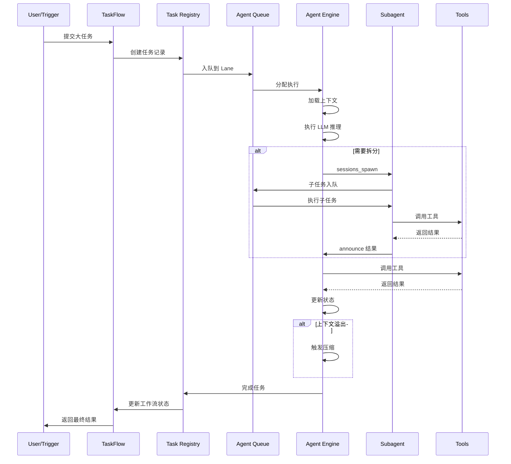
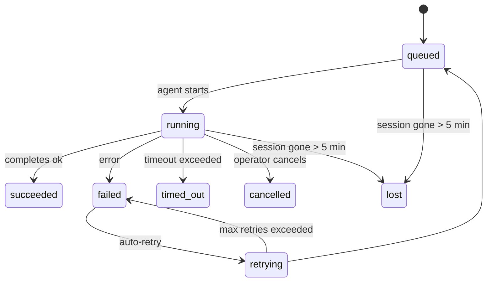

# OpenClaw 任务编排机制详解

## 📋 目录

- [1. 概述](#1-概述)
- [2. 核心架构](#2-核心架构)
- [3. 任务拆分策略](#3-任务拆分策略)
- [4. 编排执行流程](#4-编排执行流程)
- [5. Lane 队列管理](#5-lane-队列管理)
- [6. 子代理系统](#6-子代理系统)
- [7. TaskFlow 流式编排](#7-taskflow-流式编排)
- [8. Cron 定时调度](#8-cron-定时调度)
- [9. 错误处理与重试](#9-错误处理与重试)
- [10. 核心文件清单](#10-核心文件清单)

---

## 1. 概述

OpenClaw 的任务编排机制是一个**多层次、可扩展的自动化系统**，它将复杂的大任务拆分为可管理的子任务，通过 Agent 协作和队列调度实现高效执行。

### 1.1 核心能力

- **🎯 智能任务拆分**：基于 LLM 的自主任务分解
- **🤖 Agent 协作**：主代理派生子代理并行处理
- **🔀 并发控制**：Lane 队列管理系统资源竞争
- **⏰ 定时调度**：Cron 表达式驱动的周期性任务
- **🌊 流式编排**：TaskFlow 多步骤工作流管理
- **🛡️ 容错机制**：指数退避重试、失败告警、超时保护

### 1.2 设计原则

```
┌─────────────────────────────────────────────┐
│          OpenClaw 任务编排设计原则            │
├─────────────────────────────────────────────┤
│ • Local-first: 本地优先，数据主权             │
│ • Plugin-based: 插件化扩展                    │
│ • Event-driven: 事件驱动架构                  │
│ • Fault-tolerant: 容错与自愈                  │
│ • Observable: 可观测性与诊断                  │
└─────────────────────────────────────────────┘
```

---

## 2. 核心架构

### 2.1 分层架构

```
┌──────────────────────────────────────────────────┐
│              User / External Trigger               │
│         (Chat, Cron, Webhook, API Call)           │
└────────────────────┬─────────────────────────────┘
                     │
┌────────────────────▼─────────────────────────────┐
│              Task Flow Layer                       │
│   (Multi-step workflow orchestration)             │
│   src/tasks/task-flow-registry.ts                 │
└────────────────────┬─────────────────────────────┘
                     │
┌────────────────────▼─────────────────────────────┐
│              Task Registry Layer                   │
│   (Background task tracking & lifecycle)          │
│   src/tasks/task-registry.ts                      │
└────────────────────┬─────────────────────────────┘
                     │
┌────────────────────▼─────────────────────────────┐
│              Agent Execution Layer                 │
│   (LLM reasoning + tool execution)                │
│   src/agents/pi-embedded-runner/run.ts            │
└────────────────────┬─────────────────────────────┘
                     │
┌────────────────────▼─────────────────────────────┐
│              Subagent System                       │
│   (Parallel task decomposition)                   │
│   src/agents/subagent-spawn.ts                    │
└────────────────────┬─────────────────────────────┘
                     │
┌────────────────────▼─────────────────────────────┐
│              Lane Queue Manager                    │
│   (Concurrency control & isolation)               │
│   src/process/command-queue.ts                    │
└────────────────────┬─────────────────────────────┘
                     │
┌────────────────────▼─────────────────────────────┐
│              Tool Execution Layer                  │
│   (Shell, File, Network, Custom Tools)            │
│   src/agents/pi-tools.*                           │
└──────────────────────────────────────────────────┘
```

### 2.2 关键组件

| 组件 | 职责 | 核心文件 |
|------|------|---------|
| **TaskFlow Registry** | 管理多步骤工作流状态 | `src/tasks/task-flow-registry.ts` |
| **Task Registry** | 跟踪后台任务生命周期 | `src/tasks/task-registry.ts` |
| **Pi Embedded Runner** | Agent 执行引擎 | `src/agents/pi-embedded-runner/run.ts` |
| **Subagent Spawn** | 子代理派生与管理 | `src/agents/subagent-spawn.ts` |
| **Command Queue** | Lane 队列调度 | `src/process/command-queue.ts` |
| **Cron Service** | 定时任务调度 | `src/cron/service/ops.ts` |

---

## 3. 任务拆分策略

### 3.1 拆分维度

OpenClaw 支持多种任务拆分方式：

#### 3.1.1 基于 Agent 能力的拆分

```typescript
// 主 Agent 识别任务复杂度并决定是否需要拆分
const complexity = await analyzeTaskComplexity(task);

if (complexity > THRESHOLD) {
  // 拆分为多个子任务
  const subtasks = await decomposeTask(task);
  
  // 并行执行子任务
  for (const subtask of subtasks) {
    spawnSubagent({ task: subtask });
  }
}
```

#### 3.1.2 基于工具调用的拆分

Agent 在执行过程中，根据需要使用不同的工具进行任务分解：

- **sessions_spawn**: 创建独立的子代理会话
- **llm-task**: 调用专门的 LLM 处理特定子任务
- **openclaw.invoke**: 调用 Lobster 工作流步骤

#### 3.1.3 基于上下文的拆分

当上下文长度接近模型限制时，自动触发**上下文压缩**或**任务分段**：

```typescript
// src/agents/pi-embedded-runner/compact.ts
async function compactContext(params: CompactParams): Promise<CompactResult> {
  // 1. 保留最近的消息
  const recentMessages = messages.slice(-RECENT_MESSAGE_COUNT);
  
  // 2. 压缩历史消息为摘要
  const summary = await summarizeHistory({
    messages: oldMessages,
    model: compressionModel,
  });
  
  // 3. 构建新的上下文
  return [
    { role: "system", content: summary },
    ...recentMessages,
  ];
}
```

### 3.2 sessions_spawn 工具

这是**最核心的任务拆分机制**，允许 Agent 动态创建子代理。

#### 参数说明

```typescript
interface SessionsSpawnParams {
  task: string;              // 必需：任务描述
  label?: string;            // 可选：任务标签
  runtime?: "subagent" | "acp";  // 运行时类型
  agentId?: string;          // 目标 Agent ID
  model?: string;            // 模型覆盖
  thinking?: string;         // 思考级别
  runTimeoutSeconds?: number;// 超时时间
  thread?: boolean;          // 线程绑定
  mode?: "run" | "session";  // 运行模式
  cleanup?: "delete" | "keep"; // 清理策略
  sandbox?: "inherit" | "require"; // 沙箱模式
  context?: "isolated" | "fork"; // 上下文模式
  attachments?: Attachment[]; // 附件传递
}
```

#### 使用示例

```prose
# OpenProse 语法中的任务拆分
parallel:
  research = session: researcher
    prompt: "Research quantum computing trends"
  
  analysis = session: analyst
    prompt: "Analyze market data"

# 整合结果
output report = session: writer
  prompt: "Synthesize research and analysis"
  context: { research, analysis }
```

#### 执行流程

```
父 Agent 调用 sessions_spawn
    ↓
验证深度限制（默认 maxDepth=2）
    ↓
检查并发限制（maxChildrenPerAgent）
    ↓
解析工作空间继承
    ↓
创建子会话（childSessionKey）
    ↓
注册到 Subagent Registry
    ↓
发射 lifecycle.create 事件
    ↓
触发 subagent_spawning Hook
    ↓
在独立 Lane 中执行子任务
    ↓
子 Agent 完成
    ↓
captureSubagentCompletionReply
    ↓
发送 announce 到父会话
    ↓
标记为完成并清理（如 cleanup="delete"）
```

### 3.3 深度与并发限制

```typescript
// src/agents/subagent-spawn.ts

// 深度限制
const maxDepth = cfg.agents?.defaults?.subagentMaxDepth ?? 2;
const currentDepth = calculateSpawnDepth(requesterSessionKey);

if (currentDepth >= maxDepth) {
  return {
    status: "forbidden",
    error: `Maximum spawn depth (${maxDepth}) reached`,
  };
}

// 并发限制
const maxChildren = cfg.agents?.defaults?.subagents?.maxChildrenPerAgent ?? 5;
const activeChildren = countActiveChildren(requesterSessionKey);

if (activeChildren >= maxChildren) {
  return {
    status: "forbidden",
    error: `Max active children reached (${activeChildren}/${maxChildren})`,
  };
}
```

---

## 4. 编排执行流程

### 4.1 完整执行链路



### 4.2 Agent 执行引擎

核心文件：[`src/agents/pi-embedded-runner/run.ts`](file:///Users/sunshoucai/vscodeProjects/openclaw/src/agents/pi-embedded-runner/run.ts)

#### 执行步骤

```typescript
export async function runEmbeddedPiAgent(
  params: RunEmbeddedPiAgentParams
): Promise<EmbeddedPiRunResult> {
  
  // 1. 解析工作空间
  const workspaceResolution = resolveRunWorkspaceDir({
    workspaceDir: params.workspaceDir,
    sessionKey: params.sessionKey,
    agentId: params.agentId,
  });
  
  // 2. 加载运行时插件
  ensureRuntimePluginsLoaded({
    config: params.config,
    workspaceDir: resolvedWorkspace,
  });
  
  // 3. 触发 Hook（before_agent_start）
  await hookRunner.runBeforeAgentStart(hookCtx);
  
  // 4. 执行 Agent 循环
  const attemptResult = await runEmbeddedAttempt({
    prompt: params.prompt,
    images: params.images,
    provider: params.provider,
    modelId: params.modelId,
    tools: createOpenClawTools({...}),
    timeoutMs: params.timeoutMs,
  });
  
  // 5. 处理流式输出和工具调用
  return processAttemptResult(attemptResult);
}
```

#### 重试与回退机制

```typescript
// 模型回退策略
const failoverDecision = resolveRunFailoverDecision({
  error,
  retryCount,
  maxRetries,
  authProfiles,
});

if (failoverDecision.shouldRetry) {
  // 切换到备用模型或认证配置
  return await runWithFallback({
    provider: failoverDecision.provider,
    model: failoverDecision.model,
    authProfileId: failoverDecision.authProfileId,
  });
}
```

### 4.3 上下文管理

#### 上下文引擎

```typescript
// src/context-engine/types.ts

interface ContextEngine {
  // 组装上下文
  assemble(params: {
    sessionId: string;
    messages: AgentMessage[];
    tokenBudget?: number;
  }): Promise<AssembleResult>;
  
  // 压缩上下文
  compact(params: {
    sessionId: string;
    sessionFile: string;
    tokenBudget?: number;
    force?: boolean;
  }): Promise<CompactResult>;
  
  // Turn 后维护
  afterTurn?(params: {
    sessionId: string;
    messages: AgentMessage[];
    isHeartbeat?: boolean;
    tokenBudget?: number;
  }): Promise<void>;
}
```

#### 自动压缩触发

```typescript
// 当估计 token 数超过预算时触发
if (estimatedTokens > tokenBudget * COMPACTION_THRESHOLD) {
  await compactEmbeddedPiSession({
    sessionId,
    sessionKey,
    tokenBudget,
    force: false, // 自动触发
  });
}
```

---

## 5. Lane 队列管理

### 5.1 什么是 Lane？

**Lane** 是 OpenClaw 的**并发控制机制**，将不同类型的任务分配到独立的队列中，避免资源竞争和优先级倒置。

### 5.2 Lane 类型

```typescript
// src/process/lanes.ts

export enum CommandLane {
  MAIN = "main",           // 主会话（串行执行）
  SUBAGENT = "subagent",   // 子代理（最多 3 个并发）
  ACP = "acp",             // ACP 协议（串行）
  CRON = "cron",           // 定时任务（最多 2 个并发）
  CHAT = "chat",           // 聊天消息
  TOOL = "tool",           // 工具调用
  CONTEXT_ENGINE_MAINTENANCE = "context-engine-maintenance:*", // 上下文维护
}
```

### 5.3 并发配置

```typescript
// src/process/command-queue.ts

const LANE_CONCURRENCY: Record<string, number> = {
  main: 1,        // 主会话严格串行，保证顺序
  subagent: 3,    // 子代理允许适度并行
  acp: 1,         // ACP 串行
  cron: 2,        // 定时任务有限并行
  chat: 5,        // 聊天消息较高并发
  tool: 10,       // 工具调用高并发
};
```

### 5.4 队列实现

```typescript
// src/process/command-queue.ts

class CommandQueue {
  private lanes = new Map<string, LaneState>();
  
  async enqueue<T>(
    lane: string,
    task: () => Promise<T>,
    opts?: EnqueueOptions
  ): Promise<T> {
    const state = this.getOrCreateLane(lane);
    
    return new Promise((resolve, reject) => {
      // 加入队列
      state.queue.push({
        task,
        resolve,
        reject,
        enqueuedAt: Date.now(),
      });
      
      // 立即尝试调度
      this.drainLane(lane);
    });
  }
  
  private drainLane(lane: string) {
    const state = this.lanes.get(lane);
    if (!state || state.draining) return;
    
    state.draining = true;
    
    try {
      while (
        state.activeTaskIds.size < state.maxConcurrent &&
        state.queue.length > 0
      ) {
        const entry = state.queue.shift()!;
        const taskId = this.nextTaskId++;
        
        state.activeTaskIds.add(taskId);
        
        // 异步执行
        void (async () => {
          try {
            const result = await entry.task();
            state.activeTaskIds.delete(taskId);
            entry.resolve(result);
            
            // 继续调度
            this.drainLane(lane);
          } catch (err) {
            state.activeTaskIds.delete(taskId);
            entry.reject(err);
            
            // 继续调度
            this.drainLane(lane);
          }
        })();
      }
    } finally {
      state.draining = false;
    }
  }
}
```

### 5.5 Session Lane

每个会话还有自己的 **Session Lane**，确保同一会话内的任务按顺序执行：

```typescript
// src/agents/pi-embedded-runner/lanes.ts

export function resolveSessionLane(sessionKey: string): string {
  return `session:${sessionKey}`;
}

// 使用时嵌套两层队列
await enqueueCommandInLane(sessionLane, () =>
  enqueueCommandInLane(globalLane, async () => {
    // 实际执行逻辑
  })
);
```

---

## 6. 子代理系统

### 6.1 子代理注册表

文件：[`src/agents/subagent-registry.ts`](file:///Users/sunshoucai/vscodeProjects/openclaw/src/agents/subagent-registry.ts)

```typescript
type SubagentRunRecord = {
  runId: string;
  childSessionKey: string;           // e.g., "agent:main:subagent:child-123"
  controllerSessionKey?: string;     // 父代理 session key
  requesterSessionKey: string;       // 请求者 session key
  task: string;                      // 任务描述
  cleanup: "delete" | "keep";        // 完成后是否删除会话
  createdAt: number;
  startedAt?: number;
  endedAt?: number;
  outcome?: SubagentRunOutcome;
  frozenResultText?: string | null;  // 冻结的结果文本
};
```

### 6.2 子代理生命周期

```
创建阶段                    执行阶段                    清理阶段
┌──────────┐            ┌──────────┐               ┌──────────┐
│register  │───────────▶│ execute  │──────────────▶│ cleanup  │
│Subagent  │            │ in lane  │               │ session  │
└──────────┘            └──────────┘               └──────────┘
     │                        │                          │
     ▼                        ▼                          ▼
• 生成唯一 runId        • 分配独立 lane           • cleanup="delete"
• 创建子会话            • 隔离上下文              • 删除会话
• 持久化记录            • 并行执行                • cleanup="keep"
                                                      • 保留会话历史
```

### 6.3 结果通知机制

文件：[`src/agents/subagent-announce.ts`](file:///Users/sunshoucai/vscodeProjects/openclaw/src/agents/subagent-announce.ts)

```typescript
// 捕获子代理完成回复
async function captureSubagentCompletionReply(
  childSessionKey: string
): Promise<string | null> {
  // 等待子代理会话产生回复
  const reply = await waitForSessionReply(childSessionKey, {
    timeoutMs: TIMEOUT_MS,
  });
  
  return reply?.text ?? null;
}

// 发送 announce 到父会话
async function runSubagentAnnounceFlow(params: {
  childSessionKey: string;
  requesterSessionKey: string;
  outcome: SubagentOutcome;
}): Promise<void> {
  const message = buildAnnounceMessage(params);
  
  await callGateway({
    method: "agent",
    params: {
      sessionKey: params.requesterSessionKey,
      message,
      deliver: false, // 不直接发送，作为用户消息插入
    },
  });
}
```

### 6.4 工作空间继承

```typescript
// src/agents/subagent-spawn.ts

function resolveInheritedWorkspace(params: {
  requesterSessionKey: string;
  targetAgentId: string;
  explicitWorkspaceDir?: string;
}): string {
  // 1. 显式覆盖优先
  if (params.explicitWorkspaceDir) {
    return params.explicitWorkspaceDir;
  }
  
  // 2. 同 Agent 内 spawn: 继承父级 workspace
  const requesterAgentId = extractAgentId(params.requesterSessionKey);
  if (requesterAgentId === params.targetAgentId) {
    const requesterSession = getSession(params.requesterSessionKey);
    return requesterSession.workspaceDir;
  }
  
  // 3. 跨 Agent spawn: 使用目标 Agent 配置
  const targetAgentConfig = loadAgentConfig(params.targetAgentId);
  return targetAgentConfig.workspaceDir || getDefaultWorkspace();
}
```

---

## 7. TaskFlow 流式编排

### 7.1 什么是 TaskFlow？

**TaskFlow** 是位于后台任务之上的**流式编排层**，管理持久的多步骤工作流，具有自己的状态、版本跟踪和同步语义。

文件：[`src/tasks/task-flow-registry.ts`](file:///Users/sunshoucai/vscodeProjects/openclaw/src/tasks/task-flow-registry.ts)

### 7.2 使用场景

| 场景 | 使用 |
|------|------|
| 单步后台任务 | 普通 Task |
| 多步流水线（A→B→C） | TaskFlow（托管） |
| 观察外部创建的任务 | TaskFlow（镜像） |
| 一次性提醒 | Cron Job |

### 7.3 TaskFlow 记录

```typescript
interface TaskFlowRecord {
  flowId: string;
  ownerKey: string;              // 所有者 session key
  status: TaskFlowStatus;        // running, completed, failed, cancelled
  notifyPolicy: TaskNotifyPolicy;
  goal: string;                  // 工作目标
  currentStep?: string;          // 当前步骤
  blockedTaskId?: string;        // 阻塞的任务 ID
  blockedSummary?: string;       // 阻塞原因摘要
  controllerId?: string;         // 控制器 ID
  stateJson?: JsonValue;         // 自定义状态
  waitJson?: JsonValue;          // 等待条件
  syncMode: TaskFlowSyncMode;    // managed, mirrored
  revision: number;              // 版本号（乐观锁）
  createdAt: number;
  updatedAt: number;
  endedAt?: number;
}
```

### 7.4 可靠的工作流模式

对于定期工作流（如市场情报简报），将调度、编排和可靠性检查作为独立层：

1. 使用 **Scheduled Tasks** 进行定时
2. 使用持久化 cron session 构建先前的上下文
3. 使用 **Lobster** 进行确定性步骤、审批门和恢复令牌
4. 使用 **TaskFlow** 跟踪跨子任务、等待、重试和网关重启的多步骤运行

示例 cron 配置：

```bash
openclaw cron add \
  --name "Market intelligence brief" \
  --cron "0 7 * * 1-5" \
  --tz "America/New_York" \
  --session session:market-intel \
  --message "Run the market-intel Lobster workflow. Verify source freshness before summarizing." \
  --announce \
  --channel slack \
  --to "channel:C1234567890"
```

工作流内部在 LLM 摘要步骤之前放置可靠性检查：

```yaml
name: market-intel-brief
steps:
  - id: preflight
    command: market-intel check --json
  - id: collect
    command: market-intel collect --json
    stdin: $preflight.json
  - id: summarize
    command: market-intel summarize --json
    stdin: $collect.json
  - id: approve
    command: market-intel deliver --preview
    stdin: $summarize.json
    approval: required
  - id: deliver
    command: market-intel deliver --execute
    stdin: $summarize.json
    condition: $approve.approved
```

---

## 8. Cron 定时调度

### 8.1 Cron 系统架构

文件：[`src/cron/service/ops.ts`](file:///Users/sunshoucai/vscodeProjects/openclaw/src/cron/service/ops.ts)

```
┌─────────────────────────────────────┐
│       Cron Service (Singleton)       │
├─────────────────────────────────────┤
│ • Job Store (jobs.json)             │
│ • State Store (jobs-state.json)     │
│ • Timer Manager                      │
│ • Missed Job Recovery                │
└────────────┬────────────────────────┘
             │
             ▼
┌─────────────────────────────────────┐
│       Job Execution Pipeline         │
├─────────────────────────────────────┤
│ 1. Check if job is due              │
│ 2. Mark as running                  │
│ 3. Execute in CRON lane             │
│ 4. Update state                     │
│ 5. Schedule next run                │
└─────────────────────────────────────┘
```

### 8.2 启动补偿机制

当 Gateway 重启时，可能错过了一些定时任务的执行窗口。Cron 系统提供了**启动补偿机制**：

```typescript
// src/cron/service/ops.ts

export async function start(state: CronServiceState) {
  // 1. 清理僵死的 runningAtMs 标记
  await locked(state, async () => {
    for (const job of jobs) {
      if (typeof job.state.runningAtMs === "number") {
        job.state.runningAtMs = undefined;  // 清除卡住的标记
        startupInterruptedJobIds.add(job.id);
      }
    }
  });
  
  // 2. 执行错过的任务（跳过刚才清理的任务）
  await runMissedJobs(state, { skipJobIds: startupInterruptedJobIds });
  
  // 3. 重新计算所有任务的 nextRunAtMs
  await locked(state, async () => {
    recomputeNextRuns(state);
    await persist(state);
    armTimer(state);
  });
}

/**
 * 执行错过的任务
 */
export async function runMissedJobs(state: CronServiceState, opts?) {
  const plan = await planStartupCatchup(state, opts);
  
  // 立即执行一部分（默认最多 5 个）
  const outcomes = await executeStartupCatchupPlan(state, plan);
  
  // 剩余的任务延迟执行（错峰执行，避免网关过载）
  await applyStartupCatchupOutcomes(state, plan, outcomes);
}
```

**错峰执行策略**：
```typescript
// 延迟执行的任务，按 staggerMs 间隔依次调度
let offset = staggerMs;  // 默认 5000ms
for (const jobId of deferredJobIds) {
  job.state.nextRunAtMs = baseNow + offset;
  offset += staggerMs;  // 每个任务延迟 5 秒
}
```

### 8.3 任务执行

```typescript
async function executeJobCoreWithTimeout(params: {
  job: CronJob;
  state: CronServiceState;
}): Promise<CronExecutionResult> {
  const timeoutMs = params.job.timeoutMs ?? DEFAULT_CRON_TIMEOUT_MS;
  
  return await enqueueCommandInLane(CommandLane.CRON, async () => {
    // 执行 cron payload
    const result = await executeCronPayload({
      job: params.job,
      timeoutMs,
    });
    
    return result;
  }, {
    warnAfterMs: timeoutMs * 0.8, // 80% 超时警告
  });
}
```

---

## 9. 错误处理与重试

### 9.1 多层重试策略

#### 9.1.1 Agent 级别重试

```typescript
// src/agents/pi-embedded-runner/run.ts

const MAX_RETRIES = resolveMaxRunRetryIterations(config);

for (let attempt = 0; attempt <= MAX_RETRIES; attempt++) {
  try {
    const result = await runEmbeddedAttempt({
      provider,
      model,
      prompt,
      tools,
    });
    
    return result;
  } catch (err) {
    const failoverDecision = resolveRunFailoverDecision({
      error: err,
      retryCount: attempt,
      maxRetries: MAX_RETRIES,
    });
    
    if (!failoverDecision.shouldRetry) {
      throw err;
    }
    
    // 应用回退策略
    provider = failoverDecision.provider;
    model = failoverDecision.model;
    
    // 指数退避
    const backoffMs = resolveOverloadFailoverBackoffMs(attempt);
    await sleepWithAbort(backoffMs, signal);
  }
}
```

#### 9.1.2 Cron 任务重试

```typescript
// src/cron/service/timer.ts

function computeNextRetryDelay(consecutiveErrors: number): number {
  // 指数退避：1min, 2min, 4min, 8min, 16min, max 1hr
  const baseDelay = 60_000; // 1 minute
  const maxDelay = 3_600_000; // 1 hour
  
  return Math.min(
    baseDelay * Math.pow(2, consecutiveErrors),
    maxDelay
  );
}
```

### 9.2 错误分类

```typescript
// src/agents/pi-embedded-helpers.ts

type FailoverReason =
  | "rate_limit"           // 速率限制
  | "auth_failure"         // 认证失败
  | "billing_error"        // 计费错误
  | "context_overflow"    // 上下文溢出
  | "compaction_failure"   // 压缩失败
  | "model_error"          // 模型错误
  | "timeout"              // 超时
  | "network_error";       // 网络错误

function classifyFailoverReason(error: Error): FailoverReason {
  if (isRateLimitAssistantError(error)) {
    return "rate_limit";
  }
  if (isAuthAssistantError(error)) {
    return "auth_failure";
  }
  if (isBillingAssistantError(error)) {
    return "billing_error";
  }
  if (isLikelyContextOverflowError(error)) {
    return "context_overflow";
  }
  // ...
}
```

### 9.3 任务状态转换



### 9.4 自动维护

任务注册表每 **60 秒**运行一次清理器，处理三件事：

1. **Reconciliation**: 检查活动任务是否仍有权威运行时支持
2. **Cleanup stamping**: 在终端任务上设置 `cleanupAfter` 时间戳（endedAt + 7 天）
3. **Pruning**: 删除超过 `cleanupAfter` 日期的记录

**保留策略**：终端任务记录保留 **7 天**，然后自动修剪。

---

## 10. 核心文件清单

### 10.1 任务调度层

| 文件 | 路径 | 职责 |
|------|------|------|
| **Cron Ops** | `src/cron/service/ops.ts` | Cron 定时任务执行引擎 |
| **Cron Timer** | `src/cron/service/timer.ts` | 定时器管理和任务触发 |
| **Cron Jobs** | `src/cron/service/jobs.ts` | 任务定义和状态管理 |
| **Command Queue** | `src/process/command-queue.ts` | Lane 队列管理器 |
| **Lanes** | `src/process/lanes.ts` | Lane 类型定义 |

### 10.2 Agent 执行层

| 文件 | 路径 | 职责 |
|------|------|------|
| **Pi Runner** | `src/agents/pi-embedded-runner/run.ts` | Agent 执行引擎（核心） |
| **Compaction** | `src/agents/pi-embedded-runner/compact.ts` | 上下文压缩机制 |
| **Lanes** | `src/agents/pi-embedded-runner/lanes.ts` | Session Lane 解析 |
| **Context Maintenance** | `src/agents/pi-embedded-runner/context-engine-maintenance.ts` | 后台维护任务 |
| **Model Fallback** | `src/agents/model-fallback.ts` | 模型回退策略 |

### 10.3 子代理系统

| 文件 | 路径 | 职责 |
|------|------|------|
| **Subagent Spawn** | `src/agents/subagent-spawn.ts` | 子代理派生系统 |
| **Subagent Registry** | `src/agents/subagent-registry.ts` | 子代理注册表 |
| **Subagent Announce** | `src/agents/subagent-announce.ts` | 子代理结果通知 |
| **Sessions Spawn Tool** | `src/agents/tools/sessions-spawn-tool.ts` | sessions_spawn 工具实现 |

### 10.4 任务流编排层

| 文件 | 路径 | 职责 |
|------|------|------|
| **TaskFlow Registry** | `src/tasks/task-flow-registry.ts` | TaskFlow 注册表 |
| **Task Registry** | `src/tasks/task-registry.ts` | 任务注册表 |
| **Detached Task Runtime** | `src/tasks/detached-task-runtime.ts` | 分离任务运行时 |
| **Task Owner Access** | `src/tasks/task-owner-access.ts` | 任务所有者访问控制 |

### 10.5 工具层

| 文件 | 路径 | 职责 |
|------|------|------|
| **LLM Task Tool** | `extensions/llm-task/src/llm-task-tool.ts` | LLM Task 工具 |
| **Pi Tools** | `src/agents/pi-tools.*` | 各种工具实现 |
| **Tool Wrappers** | `src/agents/pi-tools.abort.ts` | 工具包装器（中止支持） |
| **Tool Wrappers** | `src/agents/pi-tools.before-tool-call.ts` | 工具包装器（Hook 支持） |

### 10.6 工作空间管理

| 文件 | 路径 | 职责 |
|------|------|------|
| **Workspace Run** | `src/agents/workspace-run.ts` | 工作空间解析 |
| **Agent Scope** | `src/agents/agent-scope.ts` | Agent 作用域管理 |
| **Agent Paths** | `src/agents/agent-paths.ts` | Agent 路径管理 |

### 10.7 上下文引擎

| 文件 | 路径 | 职责 |
|------|------|------|
| **Context Engine Types** | `src/context-engine/types.ts` | 上下文引擎接口定义 |
| **Context Engine Registry** | `src/context-engine/registry.ts` | 上下文引擎注册表 |
| **Context Engine Init** | `src/context-engine/init.ts` | 上下文引擎初始化 |

### 10.8 文档参考

| 文档 | 路径 | 内容 |
|------|------|------|
| **Tasks** | `docs/automation/tasks.md` | 任务系统文档 |
| **TaskFlow** | `docs/automation/taskflow.md` | TaskFlow 文档 |
| **Cron Jobs** | `docs/automation/cron-jobs.md` | Cron 任务文档 |
| **Session Tool** | `docs/concepts/session-tool.md` | 会话工具文档 |
| **任务编排机制详解** | `docs/learning/任务编排机制详解.md` | 详细机制说明 |

---

## 附录：典型使用场景

### 场景 1：研究任务分解

```prose
# 主 Agent 接收复杂研究任务
agent researcher:
  model: opus
  prompt: "You are a research expert"

# 第一步：分解任务
let plan = session: researcher
  prompt: "Break down this research topic into subtopics"

# 第二步：并行研究各个子主题
parallel:
  subtopic1 = session: researcher
    prompt: "Research subtopic 1 in depth"
  
  subtopic2 = session: researcher
    prompt: "Research subtopic 2 in depth"
  
  subtopic3 = session: researcher
    prompt: "Research subtopic 3 in depth"

# 第三步：综合结果
output final_report = session: researcher
  prompt: "Synthesize all subtopic research into a comprehensive report"
  context: { plan, subtopic1, subtopic2, subtopic3 }
```

### 场景 2：代码审查工作流

```prose
agent reviewer:
  model: sonnet
  prompt: "You are an expert code reviewer"

# 并行审查不同模块
parallel:
  api_review = session: reviewer
    prompt: "Review the API layer code in src/api/"
  
  db_review = session: reviewer
    prompt: "Review the database layer code in src/db/"
  
  ui_review = session: reviewer
    prompt: "Review the UI components in src/components/"

# 汇总审查结果
output review_summary = session: reviewer
  prompt: "Create a consolidated code review summary"
  context: { api_review, db_review, ui_review }
```

### 场景 3：定时数据管道

```bash
# 创建每日数据简报任务
openclaw cron add \
  --name "Daily Data Brief" \
  --cron "0 8 * * *" \
  --tz "Asia/Shanghai" \
  --session session:data-brief \
  --message "Run the data pipeline: fetch → transform → analyze → report"

# Lobster 工作流定义
name: data-pipeline
steps:
  - id: fetch
    command: data-fetch --sources all --json
  - id: transform
    command: data-transform --input $fetch.json --json
  - id: analyze
    command: data-analyze --input $transform.json --json
  - id: report
    command: data-report --input $analyze.json --format markdown
  - id: deliver
    command: send-report --file $report.md --channel slack
```

---

## 总结

OpenClaw 的任务编排机制通过以下核心设计实现了强大的任务管理能力：

1. **分层架构**：从 TaskFlow → Task → Agent → Subagent → Tool 的清晰分层
2. **智能拆分**：基于 LLM 的自主任务分解和 sessions_spawn 工具
3. **并发控制**：Lane 队列系统确保资源合理分配
4. **容错机制**：多层重试、模型回退、指数退避
5. **持久化状态**：TaskFlow 和 Task Registry 提供可靠的狀態跟踪
6. **灵活调度**：Cron 系统支持复杂的定时任务场景
7. **可观测性**：完整的任务生命周期跟踪和审计

这套机制使得 OpenClaw 能够高效地处理从简单的一次性任务到复杂的多步骤工作流的各种场景。
