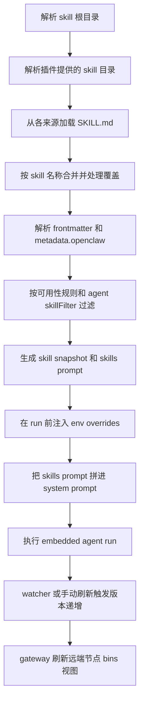

# Skills 加载原理

这篇文档按实现链路说明 OpenClaw 如何发现 skills、合并同名覆盖、
过滤可用性、生成给模型看的 skills prompt，并在 agent run 开始前把
对应配置应用到运行时。

它是 [Skills](/tools/skills) 的实现补充页。本文主要对应的代码入口有：

- `src/agents/skills/workspace.ts`
- `src/agents/skills/config.ts`
- `src/agents/skills/frontmatter.ts`
- `src/agents/skills/env-overrides.ts`
- `src/agents/skills/refresh.ts`
- `src/agents/pi-embedded-runner/skills-runtime.ts`

## 全链路总览

## 发现来源和覆盖优先级

`loadWorkspaceSkillEntries()` 在 `src/agents/skills/workspace.ts` 中负责构建
当前工作区的有效 skills 目录视图。它会按下面这些来源收集 skills：

1. `skills.load.extraDirs`
2. 通过 `resolveBundledSkillsDir()` 解析出的 bundled skills
3. `~/.openclaw/skills`
4. `~/.agents/skills`
5. `<workspace>/.agents/skills`
6. `<workspace>/skills`

实现上，加载器会先分别读取这些目录，再按“低优先级到高优先级”的顺序写入
`Map<string, Skill>`。同名 skill 后写入的条目会覆盖前面的条目，因此最终优先级是：

`skills.load.extraDirs` < bundled < `~/.openclaw/skills` < `~/.agents/skills` < `<workspace>/.agents/skills` < `<workspace>/skills`

这也是为什么工作区里的同名 skill 会覆盖 managed、bundled 或 extraDirs
来源。相关行为可在
`src/agents/skills.build-workspace-skills-prompt.prefers-workspace-skills-managed-skills.test.ts`
里看到直接验证。

这个阶段还带了几层保护：

- 支持把 `dir/skills/*` 这种嵌套仓库结构识别成真正的 skills 根目录
- 会校验 realpath，拒绝解析后跑出配置根目录之外的 skill
- 会按 `skills.limits.*` 限制候选目录数、每个来源能加载的 skill 数量和
  单个 `SKILL.md` 的最大体积

## 同名 skill 覆盖关系图

## 插件提供的 skills 如何接入

插件自己的 skills 目录由 `src/agents/skills/plugin-skills.ts` 里的
`resolvePluginSkillDirs()` 负责解析，然后被并入 extraDirs 那一层。

一个插件声明的 skills 目录只有在以下条件都满足时才会进入候选列表：

- 插件 manifest registry 里确实声明了 `skills`
- 通过 `resolveEffectiveEnableState()` 计算后插件处于启用状态
- 如果是 `acpx` 插件，ACP 不能被显式禁用
- 如果插件占用了 memory slot，还要通过 memory slot 选择逻辑

解析出的技能目录还会再经过路径安全检查：

- 路径先按插件根目录做相对解析
- 目标路径必须真实存在
- realpath 之后仍然必须位于插件根目录内

如果插件试图通过相对路径或链接跳出自己的根目录，这个目录会被直接丢弃。

因为插件 skills 最终并到和 `skills.load.extraDirs` 相同的低优先级层，
所以任何同名的 bundled、managed、agent 或 workspace skill 都会覆盖它。

## SKILL.md 解析和 metadata 提取

所有来源合并之后，每个有效 skill 都会被转换成一个 `SkillEntry`。这一步由
`src/agents/skills/frontmatter.ts` 提供的几个函数完成：

- `parseFrontmatter()`：读取原始 frontmatter
- `resolveOpenClawMetadata()`：解析 `metadata.openclaw`
- `resolveSkillInvocationPolicy()`：解析 `user-invocable` 和
  `disable-model-invocation`
- `resolveSkillKey()`：决定配置查找时使用 skill 名还是自定义 `skillKey`

后续链路会重点用到这些字段：

- `skillKey`：映射到 `skills.entries.<key>`
- `primaryEnv`：让 `apiKey` 可以自动注入到主环境变量
- `requires.bins`、`requires.anyBins`、`requires.env`、`requires.config`
- `os`、`always`、安装器 `install`
- `user-invocable` 和 `disable-model-invocation`

这里要注意两件事：

- “能不能被用户通过命令显式调用”和“会不会出现在模型提示词里”是两套概念
- `disable-model-invocation: true` 的 skill 仍然可能保留在 snapshot 中，只是不会进入模型可见的 skills prompt

## 可用性过滤和 agent skillFilter

`src/agents/skills/config.ts` 里的 `shouldIncludeSkill()` 负责决定一个
`SkillEntry` 对当前 run 来说是否有效。

这层过滤大致按下面顺序执行：

1. 如果 `skills.entries.<skillKey>.enabled === false`，直接禁用
2. 如果配置了 `skills.allowBundled`，只对 bundled skills 应用 allowlist
3. 根据 metadata 和当前运行环境评估 eligibility

eligibility 会综合这些条件：

- `metadata.openclaw.os` 指定的平台限制
- `requires.bins` 需要的本机二进制
- 通过 `SkillEligibilityContext` 传入的远端节点二进制能力
- `requires.env` 需要的环境变量
- `requires.config` 需要为 truthy 的配置路径
- `always: true`，表示跳过常规 requirement 检查

环境变量满足条件的来源不只有 `process.env`。实现上还会把这些来源一起考虑：

- 进程当前已有的环境变量
- `skills.entries.<skillKey>.env`
- `skills.entries.<skillKey>.apiKey`，前提是它对应当前 skill 的 `primaryEnv`

通过 `shouldIncludeSkill()` 之后，`filterSkillEntries()` 还会再应用
agent 级别的 `skillFilter`。如果某个 agent 配置了 skill allowlist，
那么只有明确列出的 skills 会继续保留。

这一层可以参考：

- `src/agents/skills.loadworkspaceskillentries.test.ts`
- `src/agents/skills.build-workspace-skills-prompt.prefers-workspace-skills-managed-skills.test.ts`

## Snapshot 和 skills prompt 是怎么生成的

`buildWorkspaceSkillSnapshot()` 和 `buildWorkspaceSkillsPrompt()` 都在
`src/agents/skills/workspace.ts` 中。

它们会把“已经通过 eligibility 的 skills”转换成运行时真正需要的两类产物：

- 给模型看的 `skills prompt`
- 给运行时复用的 `SkillSnapshot`

这一步有几个关键处理：

- `disable-model-invocation: true` 的 skill 不进入模型可见 prompt
- 会把 home 目录前缀压缩成 `~/...`，减少 prompt token 占用
- 会应用 `skills.limits.maxSkillsInPrompt` 和
  `skills.limits.maxSkillsPromptChars`
- 如果完整版 prompt 太长，会先降级成 compact 格式，再决定是否截断

`SkillSnapshot` 比最终 prompt 保留了更多运行时信息：

- `prompt`：最终注入 run 的 skills prompt 字符串
- `skills`：保留每个 skill 的 `name`、`primaryEnv`、`requiredEnv`
- `skillFilter`：生成 snapshot 时使用的标准化过滤器
- `resolvedSkills`：保留 canonical `Skill` 对象和原始路径
- `version`：由 watcher 维护的快照版本号

`resolvedSkills` 和“模型最终看到的列表”不是一回事：

- prompt 中的路径可能已经被压缩成 `~/...`
- prompt 可能进入 compact 模式
- prompt 也可能因为预算超限而只保留前一部分 skills
- `resolvedSkills` 则保留 canonical 路径和原始 skill 对象，给运行时继续用

这部分行为主要由下面这些测试兜住：

- `src/agents/skills.buildworkspaceskillsnapshot.test.ts`
- `src/agents/skills.resolveskillspromptforrun.test.ts`

## Run 开始前如何把 skills 真正用起来

一次 embedded run 启动时，skills 相关逻辑主要分三步：

1. `resolveEmbeddedRunSkillEntries()`  
   位于 `src/agents/pi-embedded-runner/skills-runtime.ts`。它会先判断当前
   `skillsSnapshot` 里是否已经带了 `resolvedSkills`。如果带了，runner
   就可以跳过再次从磁盘加载 skill entries。
2. `applySkillEnvOverrides()` 或 `applySkillEnvOverridesFromSnapshot()`  
   位于 `src/agents/skills/env-overrides.ts`。它会把
   `skills.entries.*.env` 和 `skills.entries.*.apiKey` 映射到本次 run
   的宿主进程环境变量。
3. `resolveSkillsPromptForRun()`  
   会优先复用 snapshot 里的 `prompt`，如果 snapshot 没有 prompt，
   才退回到根据 entries 重新构建。

最后，在 `src/agents/pi-embedded-runner/run/attempt.ts` 里，
`skillsPrompt` 会被传给 `buildEmbeddedSystemPrompt()`，作为 system prompt
的一部分进入模型。

env override 这层还有几个实现上的保护：

- 只会补那些当前没有被“外部真实环境”占用的 env key
- 会阻止危险的宿主环境变量被 skill 覆盖
- 会返回一个 reverter，在 run 结束后把本次注入的 env 恢复掉

## Refresh、watcher 和重新评估

`src/agents/skills/refresh.ts` 负责在 skills 目录变化时递增快照版本，
让后续 run 能看到新的 skills 视图。

`ensureSkillsWatcher()` 只监听和 `SKILL.md` 直接相关的路径，而不是把整个
工作区都递归监听。它会覆盖这些来源：

- `<workspace>/skills`
- `<workspace>/.agents/skills`
- `~/.openclaw/skills`
- `~/.agents/skills`
- `skills.load.extraDirs` 里的额外目录
- 插件贡献出来的 skill 目录

watcher 的设计重点有几个：

- 忽略 `.git`、`node_modules`、`dist`、`.venv`、`build`、`.cache` 等大目录
- 只监听 `SKILL.md` 和 `*/SKILL.md` 这种目标
- 使用 `skills.load.watchDebounceMs` 或默认 `250ms` 做防抖
- 通过 `bumpSkillsSnapshotVersion()` 维护全局或工作区级别的版本号

gateway 端在 `src/gateway/server.impl.ts` 中订阅这些变化事件。对于
`remote-node` 之外的变更原因，它会再等待 30 秒，然后重新加载配置并调用
`refreshRemoteBinsForConnectedNodes()`，这样远端节点的二进制能力缓存也会跟着
新 skills 的要求一起刷新。

## 相关文档

- [Skills](/tools/skills)
- [Skills Config](/tools/skills-config)
- [ClawHub](/tools/clawhub)
