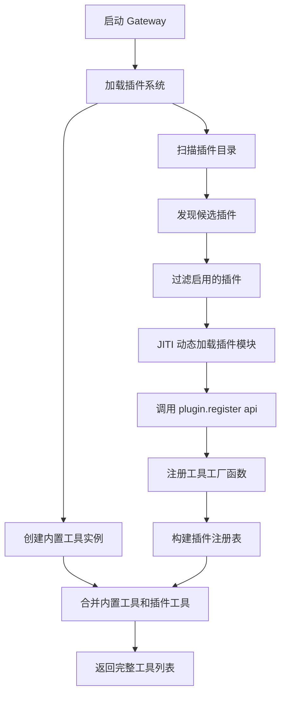
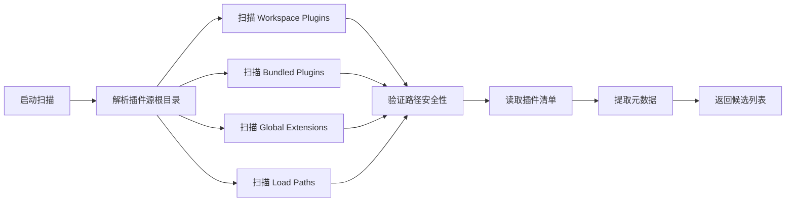
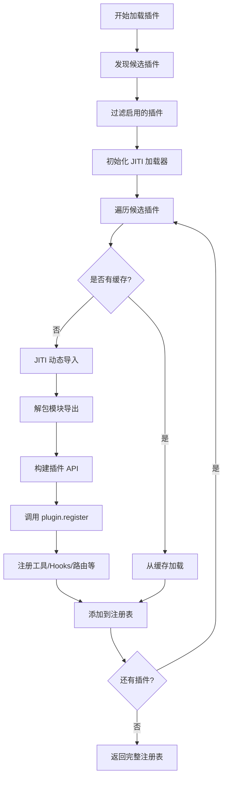
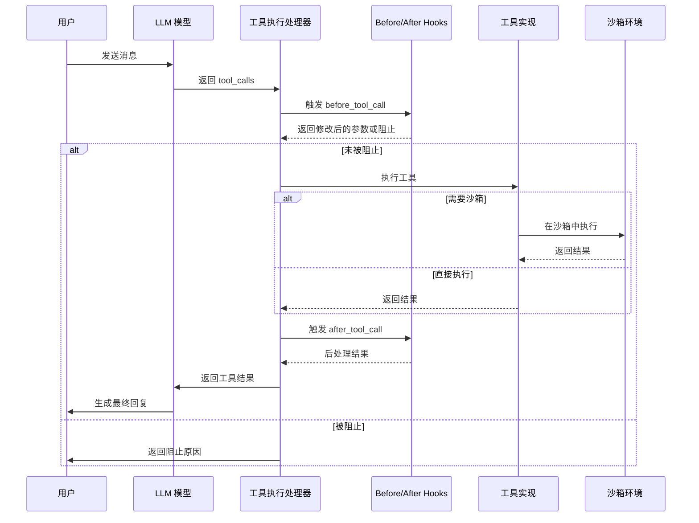

# OpenClaw Tools 系统机制详解

> **文档说明**: 本文档详细解析 OpenClaw 中工具（Tools）的注册、发现和使用机制，包括核心文件位置、工作原理和扩展方式。

## 📚 目录

- [1. 概述](#1-概述)
- [2. 工具注册机制](#2-工具注册机制)
- [3. 工具发现机制](#3-工具发现机制)
- [4. 工具使用机制](#4-工具使用机制)
- [5. 工具策略与权限](#5-工具策略与权限)
- [6. 沙箱集成](#6-沙箱集成)
- [7. 扩展开发指南](#7-扩展开发指南)
- [8. 性能优化](#8-性能优化)
- [9. 核心文件清单](#9-核心文件清单)

---

## 1. 概述

OpenClaw 的工具系统是一个分层架构，由**内置工具**和**插件工具**组成。工具是 Agent 与外部世界交互的主要方式，支持文件操作、网络请求、会话管理、媒体生成等多种功能。

### 1.1 架构特点

- **双层设计**: 核心内置工具 + 可扩展插件工具
- **动态发现**: 自动扫描和加载插件目录
- **安全沙箱**: 可选的隔离执行环境
- **细粒度权限**: 基于工具、会话、通道的访问控制
- **Hook 系统**: before/after 工具调用钩子
- **审批流程**: 危险操作的交互式审批

### 1.2 工具分类

| 类别 | 示例工具 | 说明 |
|------|---------|------|
| 文件系统 | `read`, `write`, `edit`, `ls` | 文件读写和目录操作 |
| Bash 执行 | `bash`, `bash_foreground` | Shell 命令执行 |
| 会话管理 | `sessions_list`, `sessions_send` | 会话查询和控制 |
| 媒体生成 | `image_generate`, `video_generate` | AI 媒体内容生成 |
| Web 工具 | `web_fetch`, `web_search` | 网页抓取和搜索 |
| 通信工具 | `message`, `gateway` | 消息发送和网关调用 |
| Canvas 工具 | `canvas_update` | 实时画布更新 |
| 定时任务 | `cron` | 定时任务管理 |

---

## 2. 工具注册机制

### 2.1 注册流程图



### 2.2 核心注册入口

#### 主入口函数

**文件**: [`src/agents/openclaw-tools.ts`](file:///Users/sunshoucai/vscodeProjects/openclaw/src/agents/openclaw-tools.ts)

```typescript
export function createOpenClawTools(options?: {
  agentSessionKey?: string;
  agentChannel?: GatewayMessageChannel;
  sandboxed?: boolean;
  config?: OpenClawConfig;
  // ... 更多选项
}): AnyAgentTool[] {
  // 第 1 步: 创建内置工具实例
  const imageTool = createImageTool({
    config: options?.config,
    agentDir: options.agentDir,
    workspaceDir,
    sandbox,
    fsPolicy: options?.fsPolicy,
    modelHasVision: options?.modelHasVision,
  });
  
  const webSearchTool = createWebSearchTool({
    config: options?.config,
    sandboxed: options?.sandboxed,
    runtimeWebSearch: runtimeWebTools?.search,
  });
  
  const messageTool = createMessageTool({
    agentAccountId: options?.agentAccountId,
    agentSessionKey: options?.agentSessionKey,
    config: options?.config,
    currentChannelProvider: options?.agentChannel,
    // ... 更多参数
  });
  
  // 第 2 步: 收集所有非空工具
  const tools: AnyAgentTool[] = [
    ...(embedded ? [] : [createCanvasTool({...})]),
    ...(messageTool ? [messageTool] : []),
    createTtsTool({...}),
    createSessionsListTool({...}),
    createSessionsHistoryTool({...}),
    // ... 更多内置工具
  ];
  
  // 第 3 步: 解析并添加插件工具
  if (!options?.disablePluginTools) {
    const pluginTools = resolveOpenClawPluginToolsForOptions({
      options,
      resolvedConfig,
      existingToolNames: new Set(tools.map(tool => tool.name)),
    });
    return [...tools, ...pluginTools];
  }
  
  return tools;
}
```

#### 插件工具解析

**文件**: [`src/agents/openclaw-plugin-tools.ts`](file:///Users/sunshoucai/vscodeProjects/openclaw/src/agents/openclaw-plugin-tools.ts)

```typescript
export function resolveOpenClawPluginToolsForOptions(params: {
  options?: ResolveOpenClawPluginToolsOptions;
  resolvedConfig?: OpenClawConfig;
  existingToolNames?: Set<string>;
}): AnyAgentTool[] {
  if (params.options?.disablePluginTools) {
    return [];
  }

  // 获取运行时快照
  const runtimeSnapshot = getActiveSecretsRuntimeSnapshot();
  
  // 解析插件工具
  const pluginTools = resolvePluginTools({
    ...resolveOpenClawPluginToolInputs({
      options: params.options,
      resolvedConfig: params.resolvedConfig,
      runtimeConfig: selectApplicableRuntimeConfig({...}),
    }),
    existingToolNames: params.existingToolNames ?? new Set<string>(),
    toolAllowlist: params.options?.pluginToolAllowlist,
  });

  // 应用交付默认值
  return applyPluginToolDeliveryDefaults({
    tools: pluginTools,
    deliveryContext,
  });
}
```

#### 工具注册表构建

**文件**: [`src/plugins/tools.ts`](file:///Users/sunshoucai/vscodeProjects/openclaw/src/plugins/tools.ts)

```typescript
export function resolvePluginTools(params: {
  context: OpenClawPluginToolContext;
  existingToolNames?: Set<string>;
  toolAllowlist?: string[];
  suppressNameConflicts?: boolean;
  allowGatewaySubagentBinding?: boolean;
  env?: NodeJS.ProcessEnv;
}): AnyAgentTool[] {
  // 快速路径: 如果插件被禁用，直接返回空数组
  const env = params.env ?? process.env;
  const baseConfig = applyTestPluginDefaults(params.context.config ?? {}, env);
  const context = resolvePluginRuntimeLoadContext({
    config: baseConfig,
    env,
    workspaceDir: params.context.workspaceDir,
  });
  const normalized = normalizePluginsConfig(context.config.plugins);
  if (!normalized.enabled) {
    return [];
  }

  // 获取插件注册表
  const loadOptions = buildPluginRuntimeLoadOptions(context, { runtimeOptions });
  const registry = resolvePluginToolRegistry({
    loadOptions,
    allowGatewaySubagentBinding: params.allowGatewaySubagentBinding,
  });
  if (!registry) {
    return [];
  }

  const tools: AnyAgentTool[] = [];
  const existing = params.existingToolNames ?? new Set<string>();
  const existingNormalized = new Set(Array.from(existing, tool => normalizeToolName(tool)));
  const allowlist = normalizeAllowlist(params.toolAllowlist);
  const blockedPlugins = new Set<string>();

  // 遍历注册的工具工厂
  for (const entry of registry.tools) {
    // 跳过被阻止的插件
    if (blockedPlugins.has(entry.pluginId)) {
      continue;
    }
    
    // 检查名称冲突
    const pluginIdKey = normalizeToolName(entry.pluginId);
    if (existingNormalized.has(pluginIdKey)) {
      context.logger.error(`plugin id conflicts with core tool name (${entry.pluginId})`);
      blockedPlugins.add(entry.pluginId);
      continue;
    }
    
    // 调用工厂函数创建工具
    let resolved: AnyAgentTool | AnyAgentTool[] | null | undefined = null;
    try {
      resolved = entry.factory(params.context);
    } catch (err) {
      context.logger.error(`plugin tool failed (${entry.pluginId}): ${String(err)}`);
      continue;
    }
    
    if (!resolved) {
      continue;
    }
    
    // 处理可选工具的允许列表
    const listRaw = Array.isArray(resolved) ? resolved : [resolved];
    const list = entry.optional
      ? listRaw.filter(tool => isOptionalToolAllowed({
          toolName: tool.name,
          pluginId: entry.pluginId,
          allowlist,
        }))
      : listRaw;
    
    if (list.length === 0) {
      continue;
    }
    
    // 添加工具到结果列表
    const nameSet = new Set<string>();
    for (const tool of list) {
      if (nameSet.has(tool.name) || existing.has(tool.name)) {
        context.logger.error(`plugin tool name conflict (${entry.pluginId}): ${tool.name}`);
        continue;
      }
      nameSet.add(tool.name);
      existing.add(tool.name);
      
      // 设置元数据
      pluginToolMeta.set(tool, {
        pluginId: entry.pluginId,
        optional: entry.optional,
      });
      tools.push(tool);
    }
  }

  return tools;
}
```

### 2.3 工具工厂签名

**文件**: [`src/plugins/types.ts`](file:///Users/sunshoucai/vscodeProjects/openclaw/src/plugins/types.ts)

```typescript
// 工具工厂函数类型
type OpenClawPluginToolFactory = (
  context: OpenClawPluginToolContext
) => AnyAgentTool | AnyAgentTool[] | null | undefined;

// 工具上下文接口
interface OpenClawPluginToolContext {
  config: OpenClawConfig;              // 配置对象
  workspaceDir?: string;               // 工作区目录
  agentSessionKey?: string;            // 代理会话键
  agentChannel?: GatewayMessageChannel; // 当前通道
  agentAccountId?: string;             // 账户 ID
  sandboxed?: boolean;                 // 是否沙箱化
  sandboxRoot?: string;                // 沙箱根目录
  fsPolicy?: ToolFsPolicy;             // 文件系统策略
  modelHasVision?: boolean;            // 模型是否支持视觉
  modelProvider?: string;              // 模型提供商
  modelId?: string;                    // 模型 ID
  requesterSenderId?: string | null;   // 请求者发送者 ID
  senderIsOwner?: boolean;             // 发送者是否为 owner
  sessionId?: string;                  // 会话 UUID
  // ... 更多上下文字段
}

// 工具定义接口
interface AnyAgentTool {
  name: string;                        // 工具名称
  label?: string;                      // 显示标签
  description: string;                 // 工具描述
  displaySummary?: string;             // 简短摘要
  parameters: JSONSchema;              // 参数 Schema
  execute: (
    toolCallId: string,                // 工具调用 ID
    params: unknown,                   // 调用参数
    signal?: AbortSignal,              // 中止信号
    onUpdate?: AgentToolUpdateCallback, // 更新回调
    extensionContext?: unknown         // 扩展上下文
  ) => Promise<AgentToolResult>;       // 执行函数
}
```

### 2.4 插件注册表示例

```typescript
// src/plugins/registry-types.ts
interface PluginRegistry {
  // 工具注册
  tools: Array<{
    pluginId: string;           // 插件 ID
    names: string[];            // 工具名称列表
    factory: OpenClawPluginToolFactory; // 工厂函数
    optional: boolean;          // 是否可选
    source: string;             // 来源路径
  }>;
  
  // HTTP 路由
  httpRoutes: PluginHttpRouteRegistration[];
  
  // CLI 命令
  cliCommands: PluginCliRegistration[];
  
  // Hooks
  hooks: PluginHookRegistration[];
  
  // Channel 插件
  channels: ChannelPlugin[];
  
  // Provider 插件
  providers: ProviderPlugin[];
  
  // 诊断信息
  diagnostics: PluginDiagnostic[];
}
```

---

## 3. 工具发现机制

### 3.1 插件发现流程

#### 发现流程图



#### 核心发现函数

**文件**: [`src/plugins/discovery.ts`](file:///Users/sunshoucai/vscodeProjects/openclaw/src/plugins/discovery.ts)

```typescript
export function discoverOpenClawPlugins(params: {
  workspaceDir?: string;
  extraPaths?: string[];
  ownershipUid?: number | null;
  env: NodeJS.ProcessEnv;
}): PluginDiscoveryResult {
  // A. 解析插件源根目录
  const roots = resolvePluginSourceRoots({ 
    env: params.env, 
    workspaceDir: params.workspaceDir 
  });
  
  const candidates: PluginCandidate[] = [];
  const diagnostics: PluginDiagnostic[] = [];
  
  // B. 扫描各个目录
  // 1. Workspace plugins 目录
  if (roots.workspace) {
    scanDirectory({
      rootDir: roots.workspace,
      origin: 'workspace',
      candidates,
      diagnostics,
    });
  }
  
  // 2. Bundled plugins 目录
  if (roots.stock) {
    scanDirectory({
      rootDir: roots.stock,
      origin: 'bundled',
      candidates,
      diagnostics,
    });
  }
  
  // 3. Global config extensions 目录
  if (roots.global) {
    scanDirectory({
      rootDir: roots.global,
      origin: 'global',
      candidates,
      diagnostics,
    });
  }
  
  // 4. 额外指定的 load paths
  if (params.extraPaths) {
    for (const loadPath of params.extraPaths) {
      scanPath({
        path: loadPath,
        origin: 'load-path',
        candidates,
        diagnostics,
      });
    }
  }
  
  return { candidates, diagnostics };
}

// 扫描单个目录
function scanDirectory(params: {
  rootDir: string;
  origin: PluginOrigin;
  candidates: PluginCandidate[];
  diagnostics: PluginDiagnostic[];
}): void {
  const entries = fs.readdirSync(params.rootDir, { withFileTypes: true });
  
  for (const entry of entries) {
    // 跳过忽略的目录
    if (SCANNED_DIRECTORY_IGNORE_NAMES.has(entry.name)) {
      continue;
    }
    
    const fullPath = path.join(params.rootDir, entry.name);
    
    if (entry.isDirectory()) {
      // 递归扫描子目录
      scanDirectory({
        rootDir: fullPath,
        origin: params.origin,
        candidates: params.candidates,
        diagnostics: params.diagnostics,
      });
    } else if (entry.isFile()) {
      // 检查是否是插件入口文件
      if (isPluginEntryFile(entry.name)) {
        const candidate = analyzePluginFile({
          filePath: fullPath,
          rootDir: params.rootDir,
          origin: params.origin,
        });
        if (candidate) {
          params.candidates.push(candidate);
        }
      }
    }
  }
}
```

### 3.2 插件加载流程

#### 加载流程图



#### 核心加载函数

**文件**: [`src/plugins/loader.ts`](file:///Users/sunshoucai/vscodeProjects/openclaw/src/plugins/loader.ts)

```typescript
export async function loadOpenClawPlugins(params: {
  config?: OpenClawConfig;
  activationSourceConfig?: OpenClawConfig;
  workspaceDir?: string;
  env?: NodeJS.ProcessEnv;
  logger?: PluginLogger;
  cache?: boolean;
  mode?: "full" | "validate";
}): Promise<PluginLoadResult> {
  const env = params.env ?? process.env;
  const baseConfig = applyTestPluginDefaults(params.config ?? {}, env);
  const context = resolvePluginRuntimeLoadContext({
    config: baseConfig,
    env,
    workspaceDir: params.workspaceDir,
  });
  
  // A. 发现候选插件
  const discovery = discoverOpenClawPlugins({
    workspaceDir: params.workspaceDir,
    extraPaths: resolvePluginLoadPaths(context.config),
    env,
  });
  
  // B. 过滤启用的插件
  const enabledPlugins = filterEnabledPlugins({
    candidates: discovery.candidates,
    config: context.config,
    diagnostics: discovery.diagnostics,
  });
  
  // C. 创建插件注册表
  const registry = createEmptyPluginRegistry();
  registry.diagnostics.push(...discovery.diagnostics);
  
  // D. 初始化 JITI 加载器
  const jitiCache = getCachedPluginJitiLoader({
    workspaceDir: params.workspaceDir,
    env,
  });
  
  // E. 加载每个插件
  for (const candidate of enabledPlugins) {
    try {
      // 使用 JITI 动态导入
      const modulePath = candidate.setupSource || candidate.source;
      const module = await jitiCache.jiti(modulePath);
      
      // 解包默认导出
      const pluginDef = unwrapDefaultModuleExport(module) as OpenClawPluginDefinition;
      
      // 记录导入的插件 ID
      recordImportedPluginId(pluginDef.id);
      
      // F. 构建插件 API
      const api = buildPluginApi({
        pluginId: pluginDef.id,
        pluginName: pluginDef.name || pluginDef.id,
        registry,
        source: candidate.source,
        rootDir: candidate.rootDir,
        context,
      });
      
      // G. 调用注册函数
      await pluginDef.register(api);
      
      // H. 验证注册结果
      validatePluginRegistration({
        pluginId: pluginDef.id,
        registry,
        diagnostics: registry.diagnostics,
      });
      
    } catch (err) {
      registry.diagnostics.push({
        level: "error",
        pluginId: candidate.idHint,
        source: candidate.source,
        message: `Failed to load plugin: ${String(err)}`,
      });
    }
  }
  
  // I. 初始化全局 Hook 运行器
  initializeGlobalHookRunner(registry);
  
  return registry;
}
```

### 3.3 运行时注册表管理

**文件**: [`src/plugins/runtime.ts`](file:///Users/sunshoucai/vscodeProjects/openclaw/src/plugins/runtime.ts)

```typescript
// 全局单例状态
const state: RegistryState = (() => {
  const globalState = globalThis as typeof globalThis & {
    [PLUGIN_REGISTRY_STATE]?: RegistryState;
  };
  let registryState = globalState[PLUGIN_REGISTRY_STATE];
  if (!registryState) {
    registryState = {
      activeRegistry: null,        // 当前活跃的注册表
      activeVersion: 0,            // 版本号（用于缓存失效）
      httpRoute: {
        registry: null,
        pinned: false,
        version: 0,
      },
      channel: {
        registry: null,
        pinned: false,
        version: 0,
      },
      key: null,                   // 缓存键
      workspaceDir: null,          // 工作区目录
      runtimeSubagentMode: "default",
      importedPluginIds: new Set<string>(),
    };
    globalState[PLUGIN_REGISTRY_STATE] = registryState;
  }
  return registryState;
})();

// 设置活跃注册表
export function setActivePluginRegistry(
  registry: PluginRegistry,
  cacheKey?: string,
  runtimeSubagentMode: "default" | "explicit" | "gateway-bindable" = "default",
  workspaceDir?: string,
) {
  state.activeRegistry = registry;
  state.activeVersion += 1;
  syncTrackedSurface(state.httpRoute, registry, true);
  syncTrackedSurface(state.channel, registry, true);
  state.key = cacheKey ?? null;
  state.workspaceDir = workspaceDir ?? null;
  state.runtimeSubagentMode = runtimeSubagentMode;
}

// 获取活跃注册表
export function getActivePluginRegistry(): PluginRegistry | null {
  return state.activeRegistry;
}

// 获取或创建活跃注册表
export function requireActivePluginRegistry(): PluginRegistry {
  if (!state.activeRegistry) {
    state.activeRegistry = createEmptyPluginRegistry();
    state.activeVersion += 1;
    syncTrackedSurface(state.httpRoute, state.activeRegistry);
    syncTrackedSurface(state.channel, state.activeRegistry);
  }
  return state.activeRegistry!;
}
```

---

## 4. 工具使用机制

### 4.1 工具执行全流程

#### 执行流程图



### 4.2 工具调用预处理

**文件**: [`src/agents/pi-embedded-subscribe.handlers.tools.ts`](file:///Users/sunshoucai/vscodeProjects/openclaw/src/agents/pi-embedded-subscribe.handlers.tools.ts)

```typescript
// 跟踪工具执行开始数据
const toolStartData = new Map<string, ToolStartRecord>();

interface ToolStartRecord {
  startTime: number;
  args: unknown;
}

export async function handleToolExecutionStart(
  ctx: ToolHandlerContext,
  event: {
    type: "tool_execution_start";
    toolName: string;
    toolCallId: string;
    args: unknown;
  }
): Promise<void> {
  const { runId, toolName, toolCallId, args } = event;
  
  // A. 记录工具开始时间
  toolStartData.set(buildToolStartKey(runId, toolCallId), {
    startTime: Date.now(),
    args,
  });
  
  // B. 推断工具元数据
  const meta = inferToolMetaFromArgs(toolName, args);
  const summary = buildToolCallSummary(toolName, args, meta);
  ctx.state.toolMetaById.set(toolCallId, summary);
  
  // C. 发出工具开始事件
  emitTrackedItemEvent(ctx, {
    phase: "start",
    itemId: buildToolItemId(toolCallId),
    title: buildToolItemTitle(toolName, meta),
  });
  
  // D. 运行 before_tool_call hook
  const beforeToolCallModule = await loadBeforeToolCall();
  const outcome = await beforeToolCallModule.runBeforeToolCallHook({
    toolName,
    params: args,
    toolCallId,
    ctx: {
      agentId: ctx.params.agentId,
      sessionId: ctx.params.sessionId,
      sessionKey: ctx.params.sessionKey,
      runId,
    },
  });
  
  // E. 如果 hook 阻止执行，直接返回
  if (outcome.blocked) {
    ctx.log.warn(`Tool ${toolName} blocked by before_tool_call hook: ${outcome.reason}`);
    return;
  }
  
  // F. 应用参数修改
  if (outcome.params !== undefined) {
    ctx.log.debug(`Tool ${toolName} params modified by before_tool_call hook`);
  }
}
```

### 4.3 工具定义适配器

**文件**: [`src/agents/pi-tool-definition-adapter.ts`](file:///Users/sunshoucai/vscodeProjects/openclaw/src/agents/pi-tool-definition-adapter.ts)

```typescript
export function toToolDefinitions(tools: AnyAgentTool[]): ToolDefinition[] {
  return tools.map((tool) => ({
    name: tool.name,
    description: tool.description,
    parameters: tool.parameters,
    execute: async (
      toolCallId: string,
      params: unknown,
      signal: AbortSignal | undefined,
      onUpdate: AgentToolUpdateCallback<unknown> | undefined,
      extensionContext: unknown
    ): Promise<AgentToolResult> => {
      const rawParams = params;
      
      try {
        // A. 运行 before_tool_call hook（如果工具未包装）
        if (!isToolWrappedWithBeforeToolCallHook(tool)) {
          const outcome = await runBeforeToolCallHook({
            toolName: tool.name,
            params,
            toolCallId,
            signal,
            ctx: extractHookContext(extensionContext),
          });
          
          if (outcome.blocked) {
            return buildToolExecutionErrorResult({
              toolName: tool.name,
              message: `Tool execution blocked: ${outcome.reason}`,
            });
          }
          
          params = outcome.params ?? params;
        }
        
        // B. 执行工具
        const result = await tool.execute(
          toolCallId,
          params,
          signal,
          onUpdate,
          extensionContext
        );
        
        // C. 标准化结果
        return normalizeToolExecutionResult({ 
          toolName: tool.name, 
          result 
        });
        
      } catch (err) {
        // D. 错误处理
        const errorDesc = describeToolExecutionError(err);
        ctx.log.error(`Tool ${tool.name} failed: ${errorDesc.message}`);
        
        return buildToolExecutionErrorResult({
          toolName: tool.name,
          message: errorDesc.message,
        });
      }
    },
  }));
}

// 标准化执行结果
function normalizeToolExecutionResult(params: {
  toolName: string;
  result: unknown;
}): AgentToolResult {
  const { toolName, result } = params;
  
  if (result && typeof result === "object") {
    const record = result as Record<string, unknown>;
    if (Array.isArray(record.content)) {
      return result as AgentToolResult;
    }
    logDebug(`tools: ${toolName} returned non-standard result (missing content[]); coercing`);
    const details = "details" in record ? record.details : record;
    const safeDetails = details ?? { status: "ok", tool: toolName };
    return payloadTextResult(safeDetails);
  }
  
  const safeDetails = result ?? { status: "ok", tool: toolName };
  return payloadTextResult(safeDetails);
}
```

### 4.4 工具执行后处理

**文件**: [`src/agents/pi-embedded-subscribe.handlers.tools.ts`](file:///Users/sunshoucai/vscodeProjects/openclaw/src/agents/pi-embedded-subscribe.handlers.tools.ts)

```typescript
export async function handleToolExecutionEnd(
  ctx: ToolHandlerContext,
  event: {
    type: "tool_execution_end";
    toolName: string;
    toolCallId: string;
    result: AgentToolResult;
  }
): Promise<void> {
  const { runId, toolName, toolCallId, result } = event;
  
  // A. 计算执行时间
  const startRecord = toolStartData.get(buildToolStartKey(runId, toolCallId));
  const duration = Date.now() - (startRecord?.startTime ?? Date.now());
  
  // B. 提取工具结果
  const textContent = extractToolResultText(result);
  const errorMessage = extractToolErrorMessage(result);
  const mediaArtifact = extractToolResultMediaArtifact(result);
  
  // C. 清理临时状态
  ctx.state.toolMetaById.delete(toolCallId);
  
  // D. 运行 after_tool_call hook
  const hookRunnerModule = await loadHookRunnerGlobal();
  const hookRunner = hookRunnerModule.getGlobalHookRunner();
  
  if (hookRunner.hasHooks("after_tool_call")) {
    try {
      await hookRunner.runAfterToolCall({
        toolName,
        toolCallId,
        result,
        duration,
        ctx: {
          agentId: ctx.params.agentId,
          sessionId: ctx.params.sessionId,
          sessionKey: ctx.params.sessionKey,
          runId,
        },
      });
    } catch (err) {
      ctx.log.error(`after_tool_call hook failed: ${String(err)}`);
    }
  }
  
  // E. 发出工具完成事件
  emitTrackedItemEvent(ctx, {
    phase: "end",
    itemId: buildToolItemId(toolCallId),
    title: buildToolItemTitle(toolName, ctx.state.toolSummaryById.get(toolCallId)),
    result: sanitizeToolResult(result),
  });
  
  // F. 清理跟踪数据
  toolStartData.delete(buildToolStartKey(runId, toolCallId));
}
```

### 4.5 工具结果类型

**文件**: [`src/agents/tools/common.ts`](file:///Users/sunshoucai/vscodeProjects/openclaw/src/agents/tools/common.ts)

```typescript
// 工具结果接口
interface AgentToolResult<T = unknown> {
  content: Array<{
    type: "text" | "image" | "audio" | "video" | "document";
    text?: string;           // 文本内容
    data?: string;           // Base64 编码的数据
    mimeType?: string;       // MIME 类型
    url?: string;            // 资源 URL
  }>;
  details?: T;               // 详细元数据
}

// 便捷构造函数
export function textResult(text: string, details?: unknown): AgentToolResult {
  return {
    content: [{ type: "text", text }],
    details,
  };
}

export function jsonResult(data: unknown, details?: unknown): AgentToolResult {
  return {
    content: [{ type: "text", text: JSON.stringify(data, null, 2) }],
    details,
  };
}

export function payloadTextResult(payload: unknown): AgentToolResult {
  return {
    content: [{ type: "text", text: String(payload) }],
    details: payload,
  };
}

export function imageResult(
  data: string,
  mimeType: string,
  details?: unknown
): AgentToolResult {
  return {
    content: [{ type: "image", data, mimeType }],
    details,
  };
}
```

---

## 5. 工具策略与权限

### 5.1 工具策略引擎

**文件**: [`src/agents/tool-policy.ts`](file:///Users/sunshoucai/vscodeProjects/openclaw/src/agents/tool-policy.ts)

```typescript
// 工具策略接口
interface ToolPolicy {
  allow?: string[];      // 允许的工具列表
  deny?: string[];       // 拒绝的工具列表
  ownerOnly?: string[];  // 仅 owner 可使用的工具
}

// 评估工具策略
export function evaluateToolPolicy(params: {
  toolName: string;
  agentId: string;
  sessionType: "main" | "non-main";
  channel?: string;
  senderIsOwner: boolean;
  policy: ToolPolicy;
}): { allowed: boolean; reason?: string } {
  const normalizedToolName = normalizeToolName(params.toolName);
  
  // 1. 检查 deny 列表
  if (params.policy.deny?.includes(normalizedToolName)) {
    return { 
      allowed: false, 
      reason: `Tool '${params.toolName}' is denied by policy` 
    };
  }
  
  // 2. 检查 owner-only 工具
  if (params.policy.ownerOnly?.includes(normalizedToolName)) {
    if (!params.senderIsOwner) {
      return { 
        allowed: false, 
        reason: `Tool '${params.toolName}' requires owner privileges` 
      };
    }
  }
  
  // 3. 检查 allow 列表（如果存在）
  if (params.policy.allow && params.policy.allow.length > 0) {
    if (!params.policy.allow.includes(normalizedToolName)) {
      return { 
        allowed: false, 
        reason: `Tool '${params.toolName}' is not in the allowlist` 
      };
    }
  }
  
  return { allowed: true };
}

// 规范化