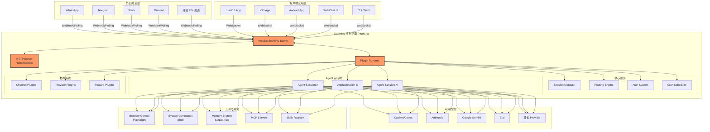
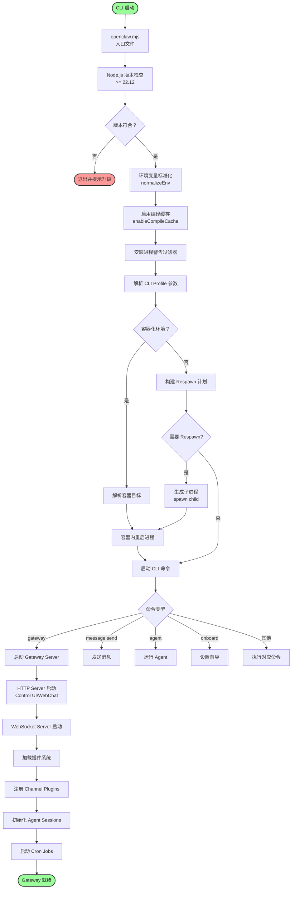
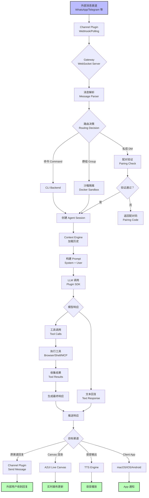
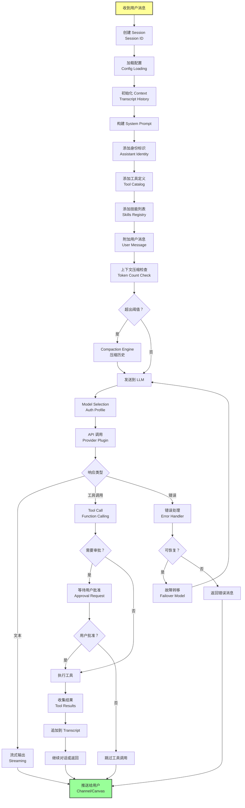
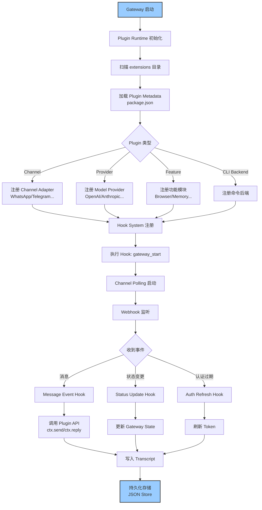
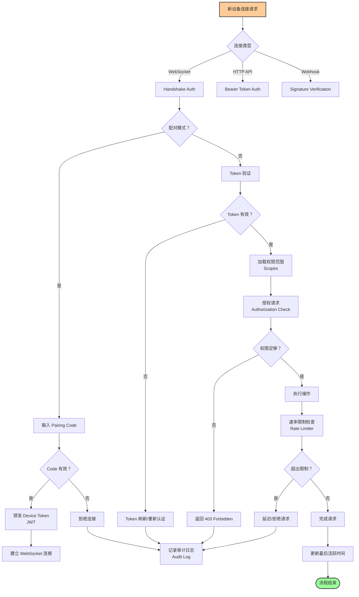
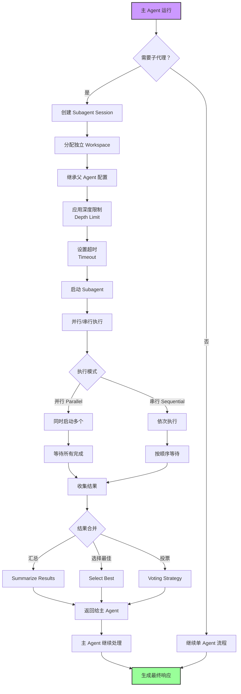
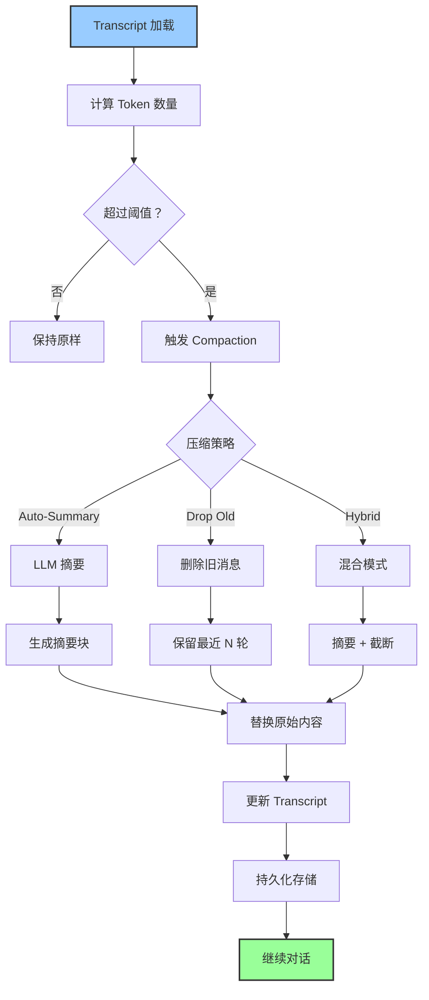
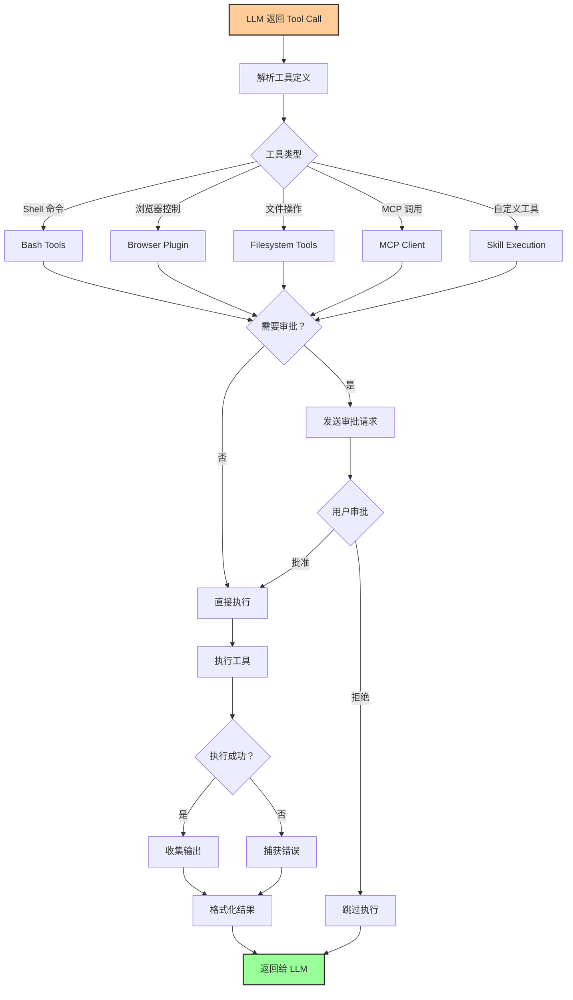
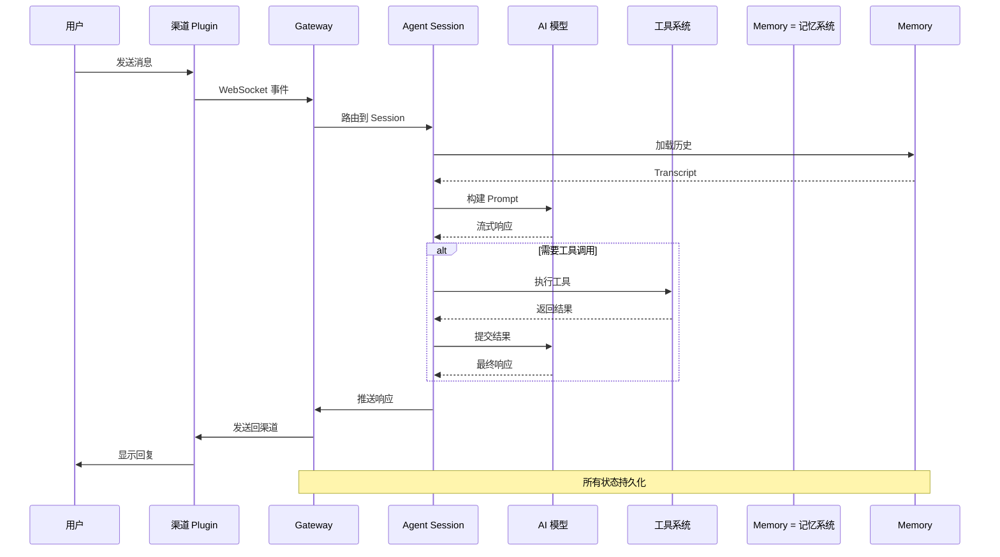

# OpenClaw 核心功能流程图

本文档包含 OpenClaw 项目的核心架构和业务流程图，帮助理解系统的整体设计和数据流。

## 目录

- [系统整体架构](#系统整体架构)
- [Gateway 启动流程](#gateway-启动流程)
- [消息处理生命周期](#消息处理生命周期)
- [Agent Session 处理流程](#agent-session-处理流程)
- [插件系统架构](#插件系统架构)
- [认证与授权流程](#认证与授权流程)
- [子代理协作流程](#子代理协作流程)
- [上下文引擎流程](#上下文引擎流程)
- [工具执行流程](#工具执行流程)

---

## 系统整体架构

---

## Gateway 启动流程

---

## 消息处理生命周期

---

## Agent Session 处理流程

---

## 插件系统架构

---

## 认证与授权流程

---

## 子代理协作流程

---

## 上下文引擎流程

---

## 工具执行流程

---

## 数据流总览

---

## 关键设计原则

### 1. 中心化网关 + 分布式节点
- **Gateway**: 控制平面，管理所有连接和状态
- **Clients**: 作为 WebSocket 客户端连接
- **Extensions**: 模块化插件系统

### 2. 会话隔离
- 每个对话在独立的 Agent Session 中运行
- 支持 Docker 沙箱隔离
- 独立的配置和上下文

### 3. 插件驱动架构
- 所有渠道、模型、功能都是插件
- Hook 系统允许拦截和扩展
- 热插拔能力

### 4. 安全优先
- 配对码验证机制
- Token -based 认证
- 速率限制和审计日志
- 敏感操作需要审批

### 5. 容错设计
- 模型故障自动转移
- 多 Auth Profile 轮换
- 会话状态持久化
- 自动重启和恢复

---

## 相关文档

- [项目介绍](../README.md)
- [愿景文档](../VISION.md)
- [贡献指南](../CONTRIBUTING.md)
- [代码注释指南](../代码注释指南.md)
- [插件原理](../插件原理.md)
- [Agent 原理](../Agent 原理.md)
